# Uyarvu Payanam — Module Workflows (with Mermaid diagrams)

> **Project:** Uyarvu Payanam (உயர்வு பயணம்) — career-guidance platform for Tamil Nadu students (Class 5–12), college students and graduates.
> **Basis:** read-only analysis of the repository `C:\Users\Priya Dharshini\Downloads\Uyarvupayanam_merged-main\Uyarvupayanam_merged-main\backend` and `frontend`. Every workflow below names the exact files/functions that implement it. Nothing fabricated.
> This document accompanies `UYARVUPAYANAM_TECHNICAL_DOCUMENTATION.md` (system report) and `UYARVUPAYANAM_ALGORITHM_ANALYSIS.md` (algorithms).

---

## 0. How the workflows are organised

For each module we give: **trigger → step-by-step → outputs → files → status**, plus Mermaid diagrams for the flagship flows (auth, LD diagnostic, recommendation, progress, Class-5, college advisor, admin notifications, data import). Modules marked ⚠️ are implemented but unreachable/dead (not mounted in `backend/server.js` or not routed in `frontend/src/student/StudentRoutes.jsx`).

---

## 1. System architecture

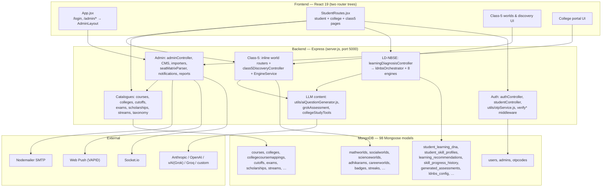

---

## 2. Module-by-module workflows

Consolidated reference (details below):

| # | Module | Trigger | Key files | Status |
|---|---|---|---|---|
| M1 | Auth / OTP | register, login, reset | `authController.js`, `studentController.js`, `utils/otpService.js` | ✅ |
| M2 | Session & roles | every guarded request | `middleware/verify*.js`, `config/axios.js` | ✅ |
| M3 | Legacy onboarding | `POST /api/onboarding/submit` | `onboardingController.js`, `utils/recommendationEngine.js` | ✅ |
| M4 | LD diagnostic | `POST /api/onboarding/ld/submit` | `learningDiagnosisController.js`, `ldnbsOrchestrator.js` + 8 engines | ✅ (reassess ⚠️) |
| M5 | LD result viewing | `GET /api/onboarding/ld/result/:studentId` | `learningDiagnosisController.getDiagnosticResult`, `RecommendationResultPage.jsx` | ✅ |
| M6 | LD admin config | `GET/PUT /api/onboarding/ld/admin/*` | `learningDiagnosisController`, `loadEffectiveConfig.js` | ✅ (no FE consumer) |
| M7 | Class-5 discovery | quiz/challenge/game/expedition | `class5DiscoveryController.js`, `class5EngineService.js` | ✅ |
| M8 | Class-5 worlds | maths/social/science/english/tamil | inline world routes + seeders | ✅ |
| M9 | Class-5 communication | journey pages, voice upload | `class5CommunicationController.js` | ✅ |
| M10 | Career paths & class content | public reads + admin CMS | `careerPathController.js`, `classContentController.js` | ✅ |
| M11 | Courses | catalogue reads + admin (public) writes | `courseController.js` | ✅ (⚠️ no auth) |
| M12 | Colleges & mapping | admin CRUD + importers + scraper | `collegeController.js`, `collegeCourseController.js`, `automatedCourseController.js` | ✅ |
| M13 | Cut-offs | TNEA explorer + admin CRUD | `cutoffController.js`, `TneaCutoffPage.jsx` | ✅ (⚠️ no auth) |
| M14 | Colleges insight | public class-12 reads | `collegesInsightController.js`, `collegesInsightCache.js` | ✅ |
| M15 | Seat matrix | admin PDF import | `seatMatrixController.js`, `utils/seatMatrixParser.js` | ✅ |
| M16 | Scholarships | CRUD + CSV/Excel import + apply | `scholarshipController.js` | ✅ (⚠️ some public) |
| M17 | College scholarships | eligibility-filtered recommends + status | `collegeScholarshipController.js`, `utils/academicEligibility.js` | ✅ |
| M18 | Exams | CRUD + CSV | `examController.js` | ✅ (⚠️ no auth) |
| M19 | Streams CMS | class-10 groups + themes | `streamController.js` | ✅ |
| M20 | Notifications | create/broadcast/read + push + socket | `notificationController.js`, `adminNotificationController.js` | ✅ |
| M21 | User actions | save/unsave/habits | `savedItemController.js`, `habitController.js` | ✅ |
| M22 | College portal | profile/advisor/study-tools/community | `collegeProfileController.js`, `collegeAdvisorController.js`, `collegeStudyToolsController.js` | ✅ |
| M23 | Graduate portal | graduate pages | `graduateController.js`, `graduateRoutes.js`, `pages/graduate/**` | ⚠️ dead |
| M24 | Academic recommendations | (would-be) `/api/recommendations` | `academicRecommendationService.js`, `recommendationRoutes.js` | ⚠️ dead |
| M25 | College onboarding backend | (would-be) `/api/college-onboarding` | `collegeOnboardingController.js`, `collegeOnboardingRoutes.js` | ⚠️ dead |

---

## 3. M1 — Authentication & OTP (full workflow)

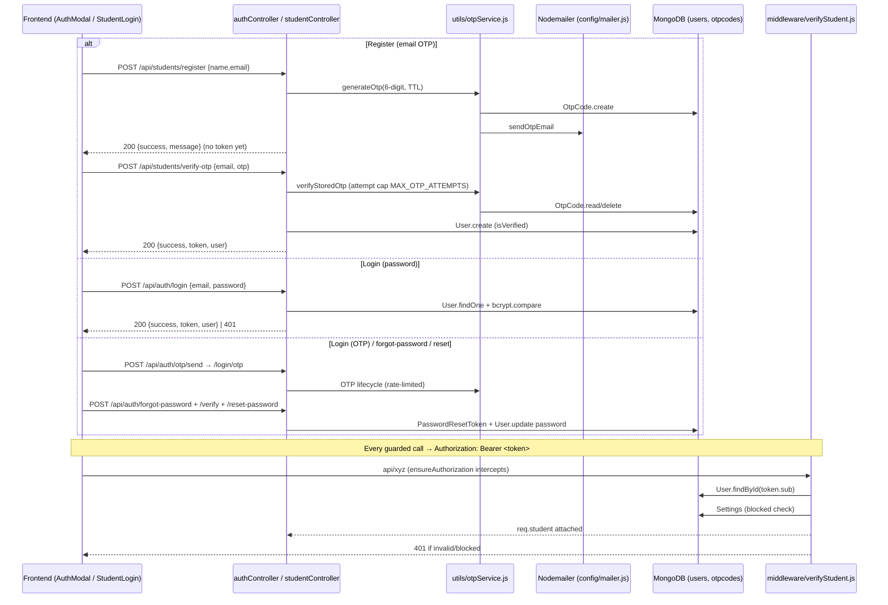

**Implementation notes (evidence):**
- Student signup/login lives in `backend/controllers/studentController.js` + `routes/studentRoutes.js` (`registerStudent`, `loginStudent`, `verifySignupOtp`, `resendSignupOtp`, rate-limited by `signupSendLimit/signupVerifyLimit/signupResendCooldown/signupResendWindow`).
- Canonical `User` auth (email OTP + password + reset) lives in `backend/controllers/authController.js` (`register`, `login`, `requestOtp`, `verifyLoginOtp`, `resendOtp`, `forgotPassword`, `verifyResetOtp`, `resetPassword`) mounted at `/api/auth`.
- Admin login is separate: `adminController.loginAdmin` → `/api/admin/login`, verified by `verifyAdmin` against the `Admin` collection.
- OTP: `backend/utils/otpService.js` exports `OTP_TTL_MS`, `MAX_OTP_ATTEMPTS`, `generateOtp`, `storeOtp`, `sendOtpEmail`, `verifyStoredOtp`.
- Middleware: `verifyStudent`, `verifyAdmin`, `verifyOwnership(param)`, `rateLimit({keyFn,max,windowMs})`. `middleware/optionalStudent.js` is **unused** (dead).
- Frontend: `frontend/src/student/context/StudentAuthContext.jsx` and `admin/context/AuthContext.jsx` hold token+user in `localStorage` (`studentToken`/`adminToken`); `frontend/src/config/axios.js` chooses the token by URL path.
- ⚠️ `AuthModal` (frontend) calls a **non-existent `signup`** API (reference bug found in frontend map). IDOR guards via `verifyOwnership` on `:userId`/`:studentId` routes.
- ⚠️ `POST /api/auth/register`, `/api/auth/login`, `/api/students/register|login` are **unauthenticated by design** (public). Several other write routes are public too (see technical report §19.3).

---

## 4. M3 — Legacy onboarding (still live, superseded by M4)

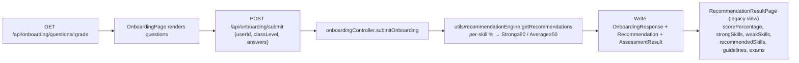

- Files: `backend/controllers/onboardingController.js` (`getQuestions`, `submitOnboarding`, `getRecommendations`, `retakeAssessment`), `backend/utils/recommendationEngine.js` (`classifySkillLevel`, `getRecommendations`), `models/Recommendation.js`, `models/OnboardingResponse.js`.
- `Retake` (`POST /api/onboarding/retake/:userId`) resets legacy collections and `User.onboardingCompleted`/`recommendationGenerated` **but does NOT delete LD collections** (defect L3).
- Dashboard summary (`dashboardSummaryController.getDashboardSummary`) still reads legacy `Recommendation` — not LD.

---

## 5. M4 — Learning DNA diagnostic (flagship workflow)

```mermaid
flowchart TD
    A["OnboardingPage (student, school_student)"]
    A --> B["POST /api/onboarding/ld/generate-questions<br/>{studentId, classLevel}"]
    B --> C["learningDiagnosisController.generateDiagnosticQuestions"]
    C --> C1["resolve grade → getBlueprintRows(grade, cfg)<br/>(honors blueprintOverrides[grade])"]
    C1 --> C2["diagnosticQuestionService.generateDiagnosticSet<br/>LLM (aiQuestionGenerator) with bank top-up"]
    C2 --> C3["Validate: 4 unique options, answer ∈ options;<br/>force subskill/weight from blueprint"]
    C3 --> D["Persist GeneratedAssessment rows<br/>(server-side correctAnswer, source normalised)<br/>strip correctAnswer from client payload"]
    D --> E["Response: sessionId + 18-20 questions + interest_1..4"]
    E --> F["Student answers (+ 4 interest questions)"]
    F --> G["POST /api/onboarding/ld/submit<br/>{studentId, sessionId, grade, answers[], interestAnswers[]}"]
    G --> H["learningDiagnosisController.submitDiagnostic<br/>(thins to orchestrator)"]
    H --> H1["ldnbsOrchestrator.runAssessmentPipeline"]
    H1 --> H2{"completionRatio ≥ 0.3?"}
    H2 -->|No| H3["HTTP 422 INCOMPLETE_ASSESSMENT<br/>nothing written; session preserved"]
    H2 -->|Yes| I
    subgraph Engines["Deterministic engines (in order)"]
        I["① grade: correctAnswer === selected"]
        I --> J["② skillDiagnosisEngine.diagnose<br/>weightedScore, status, confidence"]
        J --> K["③ learningDNAEngine.build<br/>9 dimensions + consistency"]
        K --> L["④ interestProfileEngine.compute<br/>8 categories (exposure-normalised)"]
        L --> M["⑤ gapDetectionEngine.detect<br/>4 gap rules + severity"]
        M --> N["⑥ progressAnalysisEngine.analyze<br/>improving/stable/declining/mastered"]
        N --> O["⑦ skillDependencyEngine.evaluate + buildPath<br/>locks, unlocks, learning path"]
        O --> P["⑧ nextBestSkillEngine.decide<br/>5-factor score + tie-break + type"]
        P --> Q["⑨ recommendationExplanationService<br/>summary + decision audit"]
    end
    Q --> R["Persist: bulkWrite skill profiles<br/>upsert DNA + interests + User flags<br/>insert recommendation + history + summary"]
    R --> S["200 { success, result } → RecommendationResultPage"]
```

**Key engine file references:**
- Orchestration: `backend/services/ldnbsOrchestrator.js` (`runAssessmentPipeline`, `MIN_COMPLETION_RATIO=0.3`).
- Engines: `skillDiagnosisEngine.js`, `learningDNAEngine.js`, `interestProfileEngine.js`, `gapDetectionEngine.js`, `progressAnalysisEngine.js`, `skillDependencyEngine.js`, `nextBestSkillEngine.js`, `recommendationExplanationService.js`.
- Question generation: `backend/services/diagnosticQuestionService.js`, `backend/utils/aiQuestionGenerator.js`; blueprints `backend/config/ldnbs/skillTaxonomyConfig.js`; weights/thresholds `config/ldnbs/recommendationWeights.js`; effective config `config/ldnbs/loadEffectiveConfig.js`.
- HTTP layer: `backend/controllers/learningDiagnosisController.js`.

**Decision formula (summary):**
```
score = (100 − weightedScore)/100 · 0.35                        # skillGap
      + min(1, downstreamCount·0.5 + isBlocking·0.5) · 0.25     # prerequisiteImportance
      + cognitiveGap(0|1) · 0.20                                # cognitiveGap
      + interestScoreForSkill(skill) · 0.10                     # interestAlignment
      + progressLookup(classification) · 0.10                   # recentProgress
```
Winner = max score; ties → lowest `weightedScore` → alphabetical key (`nextBestSkillEngine.js:115-120`).

---

## 6. M5 — Recommendation result viewing (LD)

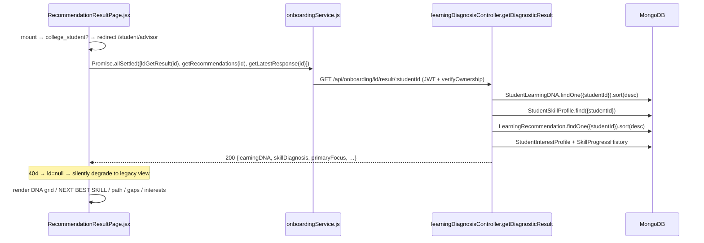

- Files: `frontend/src/student/pages/onboarding/RecommendationResultPage.jsx`, `frontend/src/services/onboardingService.js` (`ldGetResult`, `getRecommendations`, `getLatestResponse`).

---

## 7. M6 — LD admin configuration workflow

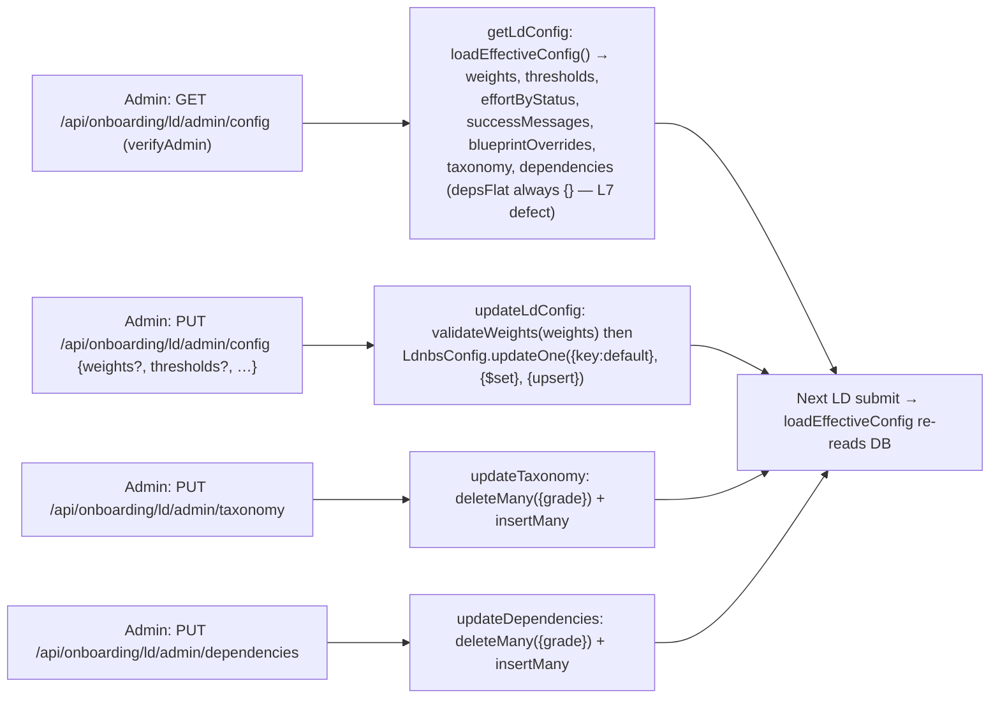

- ⚠️ No frontend consumer exists for these LD-admin endpoints (defect L13 in algorithm report; technical report §19).
- ⚠️ `thresholds` stored raw → missing `default` key reverts grades to hardcoded `{45,70,85,85}` (defect L6).

---

## 8. M7 — Class-5 discovery & gamification workflow

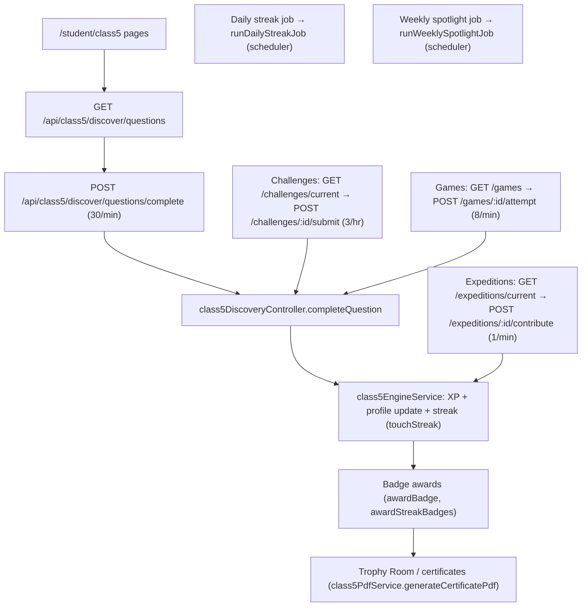

- Controller: `backend/controllers/class5DiscoveryController.js` (28 functions). Engine: `backend/services/class5EngineService.js` (`ensureSkillProfile`, `applyProfileUpdate`, `touchStreak`, `runDailyStreakJob`, `runWeeklySpotlightJob`, `startScheduler`, `awardBadge`, `awardStreakBadges`, `findCurrentExpedition`, `contributeToExpedition`).
- `startScheduler()` is called from `backend/server.js:60-61`.
- PDFs: `backend/services/class5PdfService.js` (`generateFutureMapPdf`, `generateCertificatePdf`).
- All endpoints behind `verifyStudent` plus per-action rate limits.

---

## 9. M8 — Class-5 worlds (Maths / Social / Science / English / Tamil)

Common adaptive pattern (implemented **three times** — maths, social, science; English/Tamil simpler):

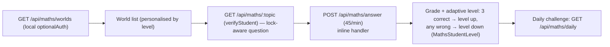

- Files: `backend/routes/mathsRoutes.js`, `socialRoutes.js`, `scienceRoutes.js` (inline handlers), `englishRoutes.js`, `tamilRoutes.js` (inline); seeders `seedMaths.js`, `seedSocial.js`, `seedScience.js`, `seedAdhikarams.js`.
- English uses `utils/speech.js` + `utils/writingAnalysis.js` (client) and `englishstudentmetas`.
- ⚠️ Local `optionalAuth` duplicates JWT logic with `process.env.JWT_SECRET || "fallback_secret"` (S4 defect).

---

## 10. M9 — Class-5 communication skills workflow

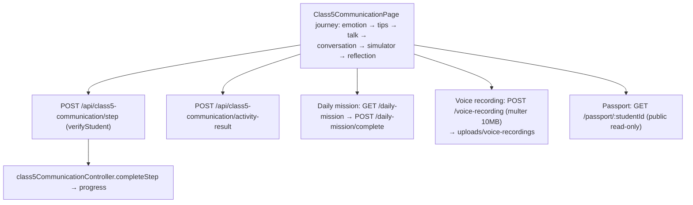

---

## 11. M10–M19 — Catalogue & class-content workflows

### M10 Career paths & class content
- Reads: `GET /api/career-paths`, `/level/:level`, `GET /api/class-content/level/:level`, `/slug/:slug` (public).
- Admin CMS: `classContentController` create/update/delete/toggle-publish/toggle-feature (`verifyAdmin`); ⚠️ `GET /api/class-content/:id` is wired to `updateContent` (defect S9).

### M11 Courses
- Public read; ⚠️ **entire router unauthenticated** — `courseController.createCourse/bulkImportCourses/previewSourceImport/importFromSource/updateCourse/deleteCourse` (S3).

### M12 Colleges & mapping
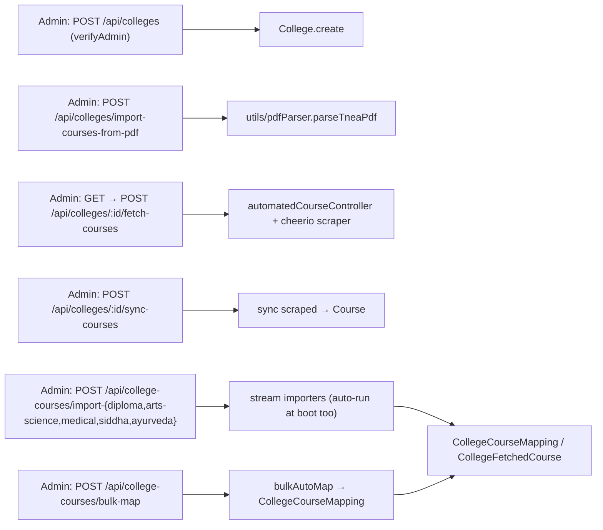

### M13 Cut-offs
- Public explorer + admin CRUD (⚠️ no auth). `POST /api/cutoffs/sync-orphans` re-links orphaned records.
- `cutoffController.deleteOrphans` is exported but **never routed**.

### M14 Colleges insight
- Public reads over `CollegeCourseMapping`/`College`/`Course`, TTL-cached in memory (`collegesInsightCache.js`).

### M15 Seat matrix import
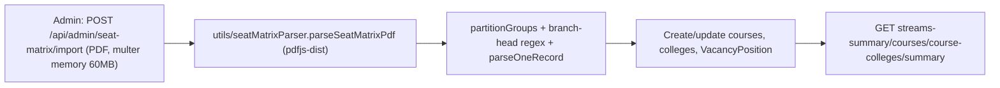

### M16/M17 Scholarships
- School: `scholarshipController` CRUD + `importScholarshipsCSV` (auth) + ⚠️ `import-csv` (repo-relative local path, public) + `upload` (public) + `apply` (public).
- College: `collegeScholarshipController` + `utils/academicEligibility.buildCollegeEligibilityFilter`; `GET /recommended` (JWT) filters by class eligibility; `POST /:id/apply-status` updates own status.

### M18 Exams / M19 Streams
- Exams: CRUD + CSV upload (⚠️ no auth). Streams: admin CMS + theme asset upload (multer 5 MB images) + bulk reorder/import.

---

## 12. M20 — Notifications workflow

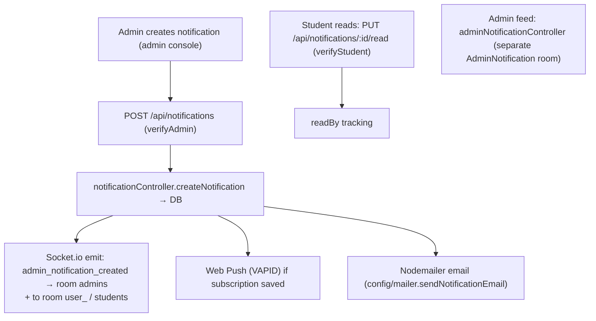

- Files: `backend/controllers/notificationController.js`, `backend/controllers/adminNotificationController.js`, `config/mailer.js`; Socket.io wired in `backend/server.js:136-181` (rooms `admins`, `students`, `user_<userId>`).
- Frontend: `admin/context/NotificationContext.jsx` (socket client; ⚠️ hard-codes `http://localhost:5000`), `NotificationBell` in admin layout.
- Notification audience targeting (roles/classes) and read-state (`readBy[]`) live in `models/Notification.js`.

---

## 13. M22 — College portal workflows

### College profile
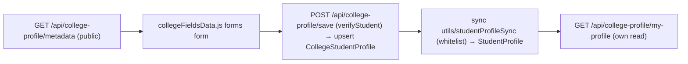

### College advisor
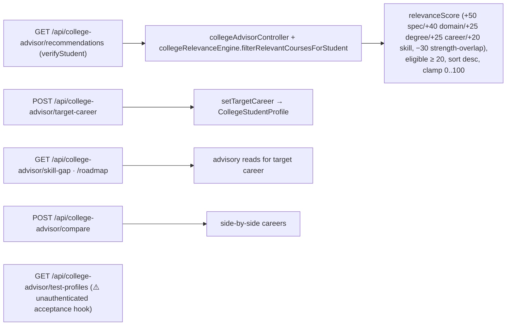

### Study tools (AI content, deterministic numbers)
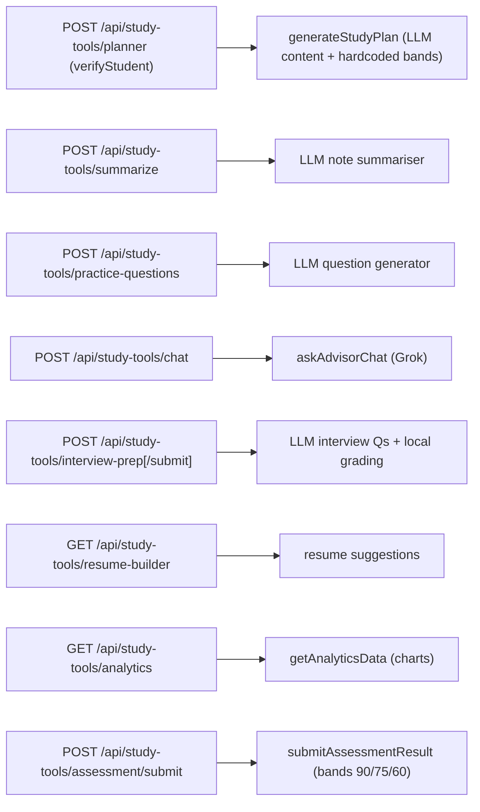

### Community
- `POST /api/mentor-requests` (⚠️ public) → `mentorRequestController.createMentorRequest`; student reads via `verifyOwnership`; admin moderates.
- `POST /api/admission-help` (public by design) → `admissionHelpController.createRequest`; admin triage via `/admin`.

---

## 14. M23–M25 — Dead / unreachable modules (⚠️)

| Module | Backend | Frontend | Why unreachable |
|---|---|---|---|
| Graduate portal | `routes/graduateRoutes.js` exists but **not mounted**; `graduateController` (career matches, `matchScore 50/30/… clamp 55-96`), `graduateAdvisorController` | `pages/graduate/**` (12 pages), `GraduateLayout` — **no `/graduate/*` routes** | `server.js:192-248` has no `/api/graduate`; `StudentRoutes.jsx` has no graduate routes |
| Academic recommendations | `routes/recommendationRoutes.js` claims \"Mounted at /api/recommendations\" — **false**; `academicRecommendationService.js` (BANDS, `allocateMinutes`, study-plan split 0.40/0.35/rest) | — | never mounted |
| College onboarding backend | `routes/collegeOnboardingControllerRoutes.js` **not mounted** (~1100 lines) | wizard instead calls `/college-profile` + `/assessment/generate-grok-questions` | never mounted |

---

## 15. Progress tracking workflow (LD progress engine)

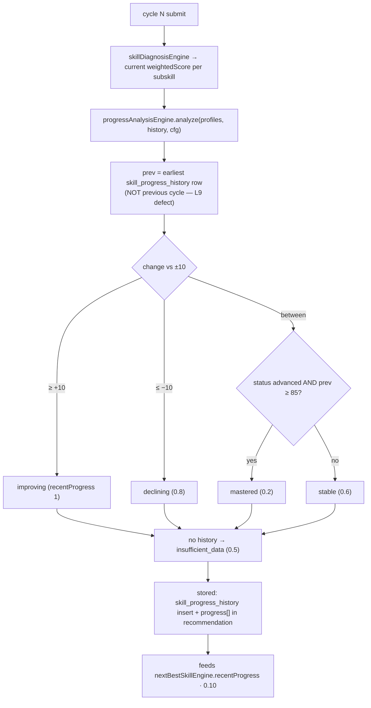

---

## 16. End-to-end example traces (evidence-based golden paths)

### Test 1 — School student completes LD
1. `POST /api/auth/register` → user created.
2. `POST /api/students/register` + `verify-otp` (OTP path) → token.
3. `GET /api/onboarding/questions/:grade` (legacy) AND `POST /api/onboarding/ld/generate-questions` (LD).
4. `POST /api/onboarding/ld/submit` → 200 with full `result`.
5. `GET /api/onboarding/ld/result/:studentId` → result page renders.
6. `GET /api/students/dashboard-summary` → legacy summary (⚠️ not LD).

### Test 2 — Admin imports seat matrix
1. `POST /api/admin/login` → admin token.
2. `POST /api/admin/seat-matrix/import` (PDF multipart) → parsed rows.
3. `GET /api/admin/seat-matrix/summary` → import totals.
4. `GET /api/cutoffs`/`/api/colleges` public reads reflect new data.

### Test 3 — College student uses advisor
1. `POST /api/college-profile/save` → profile.
2. `GET /api/college-advisor/recommendations` → relevance-scored list.
3. `GET /api/study-tools/analytics` → charts.

---

## 17. Cross-module dependency map

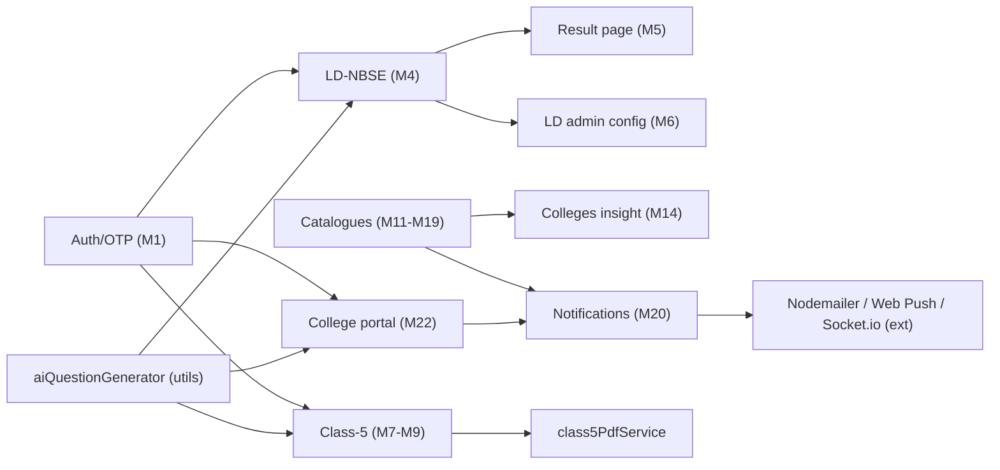

**Bottom line:** the platform's flows are mostly complete and evidence-backed; the outstanding gaps are the **wireless graduate module**, the **write-only LD reassess loop**, the **legacy-on-dashboard split**, and **auth hardening on several write routers** — all itemised with locations in §14 and the technical report §19.

*End of UYARVUPAYANAM_MODULE_WORKFLOW.md.*