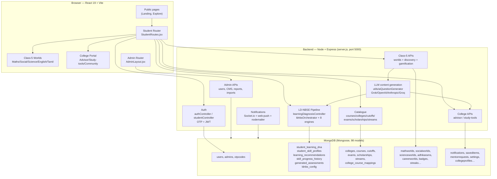
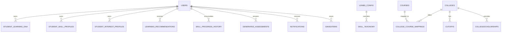
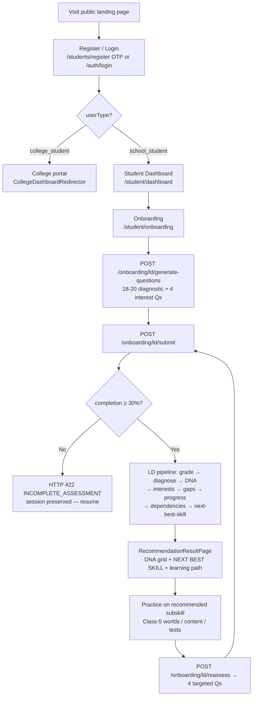
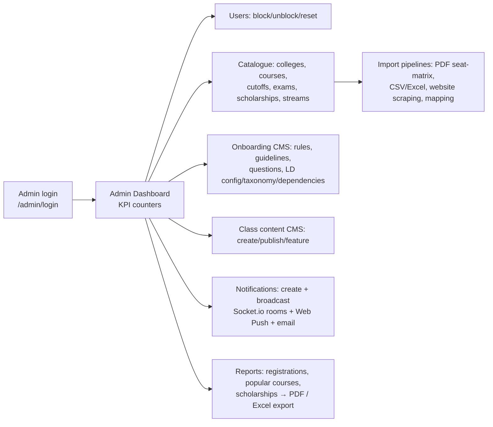
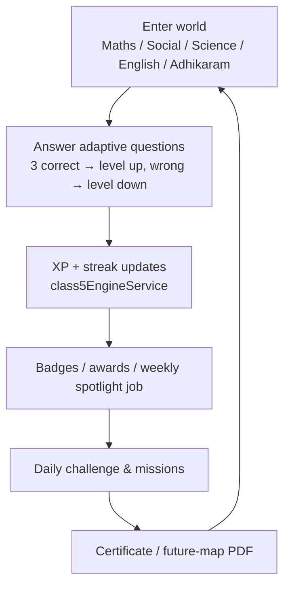
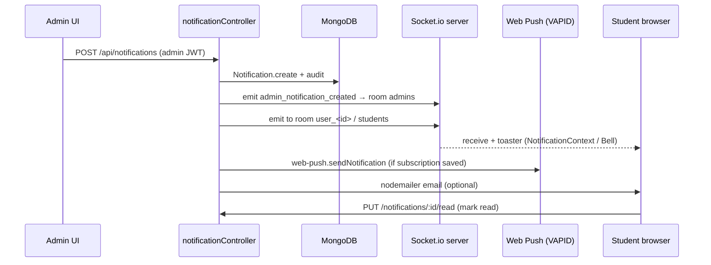

# Uyarvu Payanam (உயர்வு பயணம்) — Complete Technical Documentation

> **Document type:** Final-year project technical report (evidence-based, generated from a read-only audit of the actual source code).
> **Repository root:** `C:\Users\Priya Dharshini\Downloads\Uyarvupayanam_merged-main\Uyarvupayanam_merged-main\`
> **Status of facts:** Every module, endpoint, formula and file reference in this report was verified against the source at the time of writing. Items that are **implemented but unreachable (dead code)** or **partially connected** are explicitly marked. Nothing has been invented.

---

## Table of Contents

1. [Project Title, Abstract & Introduction](#1-project-title-abstract--introduction)
2. [Problem Statement](#2-problem-statement)
3. [Existing System](#3-existing-system)
4. [Proposed System](#4-proposed-system)
5. [Project Objectives](#5-project-objectives)
6. [Scope of the Project](#6-scope-of-the-project)
7. [System Architecture & Project Structure](#7-system-architecture--project-structure)
8. [Technology Stack](#8-technology-stack)
9. [Module Description](#9-module-description)
10. [Algorithm Identification & Explanation](#10-algorithm-identification--explanation)
11. [Recommendation Engine — Deep Analysis](#11-recommendation-engine--deep-analysis)
12. [Student Learning DNA — Deep Analysis](#12-student-learning-dna--deep-analysis)
13. [Database Design](#13-database-design)
14. [API Documentation](#14-api-documentation)
15. [End-to-End System Workflow](#15-end-to-end-system-workflow)
16. [Implementation Details](#16-implementation-details)
17. [Testing & Validation](#17-testing--validation)
18. [Results & Observations](#18-results--observations)
19. [Implementation Status & Technical Gaps](#19-implementation-status--technical-gaps)
20. [Limitations](#20-limitations)
21. [Future Enhancements](#21-future-enhancements)
22. [Conclusion](#22-conclusion)
23. [References](#23-references)

---

## 1. Project Title, Abstract & Introduction

### 1.1 Project Title
**Uyarvu Payanam (உயர்வு பயணம்) — "Ascending Journey"**: A data-driven, personalised career-guidance ecosystem for Tamil Nadu students from Class 5 to Class 12, with additional portals for college students and graduates.

### 1.2 Abstract
Uyarvu Payanam bridges the "information gap" students face at the four critical academic transitions in Tamil Nadu — **after 5th, after 8th, after 10th, and after 12th standard** — by combining:

- a **verified, admin-managed catalogue** of career paths, courses, colleges, TNEA cut-offs, scholarships and entrance exams;
- a **rule-based "Learning DNA" (LD‑NBSE) diagnostic engine** (`backend/services/ldnbsOrchestrator.js` + 8 sub-engines) that converts short assessments into a 9-dimension cognitive profile and a deterministic **next-best-skill recommendation** (5-factor weighted score, `backend/services/nextBestSkillEngine.js`);
- **gamified Class-5 "worlds"** (Maths, Social, Science, English, Tamil Adhikaram) with streaks, badges, expeditions and certificate PDFs;
- a **college-student portal** with an AI-assisted advisor, study planner, skill-gap analysis and peer mentorship;
- a full **admin console** (user management, content CMS, college↔course mapping with PDF/website ingestion, TNEA seat-matrix parsing, notifications via Socket.io and Web Push, report export to PDF/Excel).

The system is a **full-stack web application** (React + Vite frontend, Node/Express + MongoDB backend). The "AI" in the system is used **strictly for content generation** (question text, chat responses, summaries); **all decisions — skill levels, gaps, next-best-skill, recommendations — are deterministic, rule-based computations** over the student's answers. There is **no machine learning** (no trained models) anywhere in the codebase.

### 1.3 Introduction
The project started as a "career guidance" portal and grew into a layered platform:

| Layer | Purpose | Evidence |
|---|---|---|
| Public marketing site | `/` landing page, `/explore` tour | `frontend/src/student/pages/public/CommonPublicLandingPage.jsx` |
| School-student hub (Class 5/8/10/12) | Milestone roadmaps, careers, courses, colleges, scholarships, exams, cut-offs | `frontend/src/student/StudentRoutes.jsx` |
| Class-5 gamified "worlds" | Maths/Social/Science/English/Tamil + discovery/gamification | `frontend/src/student/components/{maths,social,science,english,adhikaram,class5}/`, `backend/routes/{mathsRoutes,socialRoutes,scienceRoutes,englishRoutes,tamilRoutes,class5DiscoveryRoutes}.js` |
| Learning DNA (LD‑NBSE) | Diagnostic assessment → cognitive DNA → next-best-skill recommendation | `backend/config/ldnbs/*`, `backend/services/*Engine.js`, `frontend/src/student/pages/onboarding/` |
| College portal | Profile, advisor, study tools (AI chat/planner/summarizer), community, scholarships | `frontend/src/student/pages/{advisor,academic,career,study-tools,community,scholarships}/`, `backend/routes/{collegeAdvisorRoutes,collegeStudyToolsRoutes,collegeProfileRoutes}.js` |
| Graduate module | Career/skill-gap/exam guides for graduates | **Implemented but NOT routed** in `frontend/src/student/pages/graduate/`; backend `/api/graduate` **not mounted** |
| Admin console | Full CRUD + reports + notifications + import pipelines | `frontend/src/admin/`, `backend/routes/adminRoutes.js` |

> **Documentation note:** this report prioritises what the code **actually does** over what older design docs claimed. Where the legacy `PROJECT_DOCUMENTATION.md` / `PROJECT_ABSTRACT.md` descriptions differ from the code, the code wins.

---

## 2. Problem Statement

Students in Tamil Nadu face a well-documented "information gap" at each transition point in their schooling:

1. **Misinformed stream selection** — after Class 10 students choose Maths-Biology / Maths-Computer / Commerce / Vocational streams largely on hearsay, without an understanding of where each stream leads.
2. **Missed opportunities** — scholarships, entrance exams and vocational options are scattered across government websites and are rarely surfaced to the students who qualify.
3. **Data inaccuracy** — college lists, course offerings and TNEA cut-off data change yearly and are hard to verify (Google results are stale, college sites are inconsistent).
4. **No personalisation** — guidance is static; two students with different aptitudes are told the same thing.
5. **Teacher/guide bandwidth** — a single career counsellor cannot personalise guidance for hundreds of students.

The project's stated goal (`PROJECT_ABSTRACT.md`) is to "bridge this gap by providing a dynamic, admin-managed hub that transforms career guidance into a personalized, data-led experience."

---

## 3. Existing System

The "existing system" the project replaces is the traditional fragmented landscape (described in `PROJECT_ABSTRACT.md` and mirrored by the module choices):

- Static government/university information portals (DOTE, TNEA, scholarship portals) with no personalisation.
- Anecdotal, teacher- or parent-driven career advice.
- Decentralised scholarship and exam alerts (email/SMS lists).
- Outdated college/cut-off spreadsheets.

Within the codebase there are also **two generations of the project's own "existing system"**:

- **Legacy onboarding + recommendations** (`backend/controllers/onboardingController.js`, `backend/utils/recommendationEngine.js`, `models/Recommendation.js`) — a simple rule-based "percentage → Strong/Average/Needs Improvement" engine still live and still read by the student dashboard.
- **Unreachable modules** (`routes/recommendationRoutes.js`, `routes/graduateRoutes.js`, `routes/collegeOnboardingRoutes.js` are **not mounted** in `server.js`) — fully implemented code that no HTTP request can reach.

---

## 4. Proposed System

The implemented system provides:

1. **Personalised guidance at scale** — after taking a short diagnostic (18–20 questions), a school student receives a 9-dimension Learning DNA, a "next best skill", a learning path, locked/unlocked skills, detected gaps, and interest areas (`POST /api/onboarding/ld/submit` → `RecommendationResultPage.jsx`).
2. **Verified, admin-curated data** — colleges, courses, mapping, cut-offs, scholarships, exams, streams all have admin CRUD + bulk-import pipelines (CSV/Excel/PDF/website scraping/seat-matrix PDF parsing).
3. **Gamified early education (Class 5)** — playful "worlds" in Maths, Social, Science, English and Tamil, plus a discovery engine (skill profile quiz, challenges, games, expeditions, weekly spotlight, streaks, badges, certificates).
4. **A college portal** — AI-assistant study planner, note summariser, practice questions, interview prep, resume builder, skill-gap analysis, peer mentors, doubts, and college scholarships.
5. **Communications layer** — notifications delivered via database + Socket.io (real-time admin console) and Web Push (VAPID), plus email OTP/welcome.
6. **Admin intelligence** — KPI dashboard, registration reports (with PDF/Excel export), user block/unblock, sub-admins, maintenance mode.

---

## 5. Project Objectives

(Evidence-based, mapped to actual code targets)

| # | Objective | Where implemented |
|---|---|---|
| O1 | Provide milestone-based guidance for after 5th/8th/10th/12th | `pages/careers/ClassLevelPage.jsx`, `Pages careers/*`, `routes/careerPathRoutes.js`, `routes/classContentRoutes.js` |
| O2 | Maintain a verified college & course database with mappings | `models/College.js`, `Course.js`, `CollegeCourseMapping.js`, `collegeCourseController.js`, importers |
| O3 | Publish TNEA cut-off data with filtering and orphan sync | `models/Cutoff.js`, `routes/cutoffRoutes.js`, `pages/colleges/TneaCutoffPage.jsx` |
| O4 | Alert students to scholarships & exams | `scholarshipRoutes.js`, `examRoutes.js`, `pages/scholarships/*` |
| O5 | Personalise recommendations from assessment behaviour | **LD‑NBSE pipeline** (see §11/§12) |
| O6 | Build a Class-5 learning/gamification experience | Class-5 worlds + discovery engine + `class5EngineService.js` scheduler |
| O7 | Provide a college-student AI-assisted portal | `collegeAdvisorRoutes.js`, `collegeStudyToolsRoutes.js` |
| O8 | Give admins full management + reporting | `adminRoutes.js`, `admin/pages/admin/ReportsPage.jsx` |
| O9 | Secure the platform (roles, JWT, OTP, rate limits) | `middleware/verify*.js`, `utils/otpService.js`, `middleware/rateLimit.js` |

---

## 6. Scope of the Project

**In scope (implemented and reachable):**
- Public marketing + explore pages.
- Student sign-up/login with email OTP, password reset, JWT-session.
- Onboarding diagnostics (legacy + LD‑NBSE) for school students.
- Career paths, class-level content (5/8/10/12) with admin CMS.
- Course, college, college-course-mapping, cutoff, exam, scholarship, stream, taxonomy catalogues.
- Class-5 worlds + communication-skills journey.
- College portal (profile, advisor, study tools, mentors, scholarships).
- Admin console (users, content, imports, notifications, reports, settings).
- Web Push + Socket.io notifications, email (nodemailer) for OTPs.

**Out of scope (either not routed or not wired):**
- Graduate portal (`frontend/src/student/pages/graduate/**` built; `/graduate/*` routes **absent**; backend `/api/graduate` **not mounted**).
- College onboarding via `collegeOnboardingController` (router not mounted) — the *frontend* college wizard instead uses `/college-profile` + `/assessment/generate-grok-questions`.
- Research-grade ML, real-time chat rooms for students, mobile apps, payments, proctoring.

---

---

## 7. System Architecture & Project Structure

### 7.1 High-level architecture (Mermaid)



### 7.2 Communication patterns

- **Frontend → Backend:** REST over HTTP via shared Axios clients. The primary client `frontend/src/config/axios.js` injects `Authorization: Bearer <token>` (choosing `adminToken` or `studentToken` from local storage based on the URL path). A second instance `frontend/src/student/services/studentApi.js` (12 s timeout) is used by the dashboards; per-world services (`mathsService`, `scienceService`, `socialService`, `englishService`, `adhikaramService`, `class5DiscoveryService`) have their own instances with seed-data fallbacks.
- **Backend → Database:** Mongoose (ODM). 98 model files define the collections (see §13).
- **Backend → LLM providers:** HTTPS calls to Anthropic `/v1/messages`, OpenAI-compatible `/chat/completions`, xAI `/v1` and Groq `/openai/v1`, or a custom `AI_QUESTIONS_BASE_URL`. Provider chosen by env-var precedence in `utils/aiQuestionGenerator.js:30-71`.
- **Backend → Browser (real-time):** Socket.io (`server.js:136-181`) with rooms `admins`, `students`, `user_<userId>`. Emitted events: `admin_notification_created|updated|deleted`, `admin_notifications_cleared`, `new_admin_notification`.
- **Backend → Email / Push:** nodemailer (`config/mailer.js`) for OTPs & notifications; web-push (VAPID) for browser push.
- **Backend → Files:** multer uploads under `/uploads` (served statically at `GET /uploads/*`).

### 7.3 User roles & access model

| Role | `userType`/`role` field | Where enforced | Access |
|---|---|---|---|
| Super Admin | `Admin` collection (`role` freeform; seed `uyarvupayanam@gmail.com`) | `verifyAdmin` middleware, `/admin/*` routes | Everything in admin console |
| Sub-admin | `Admin` collection (`isSubAdmin` semantics via `createSubAdmin`) | `verifyAdmin` | Same admin routes (no fine-grained rights split in code) |
| School student | `User.userType = "school_student"`, `classLevel` ∈ {5,8,10,12} | `verifyStudent` + `verifyOwnership`; `StudentProtectedRoute` | Own profile, all school pages + onboarding results |
| College student | `User.userType = "college_student"` | redirector `CollegeDashboardRedirector`; `CollegeStudentLayout` | College portal; blocked from `/student/class*` |
| Graduate | `User.userType = "graduate"` | `StudentProtectedRoute` redirect to `/student/onboarding/graduate` | Graduate pages exist but **are not routed** |
| Anonymous | — | public routes (no middleware) | Public catalogues, marketing pages |

`User.role` (enum `student|admin`, default `student`) is a lightweight flag; the real gates are the `userType` field, the `Admin` collection, and the three `verify*` middlewares.

### 7.4 Complete folder structure (top levels)

```
Uyarvupayanam_merged-main/
├── backend/                          # Node + Express API server
│   ├── config/                       # db.js, mailer.js, collegesInsightCategories.js,
│   │   │                             # collegeFieldsData.js
│   │   └── ldnbs/                    # ★ Learning-DNA config (weights, thresholds, taxonomy,
│   │                                 #   effective-config loader)
│   ├── controllers/                  # 45 route handler modules
│   ├── data/                         # polytechnicSeedData.json, streamsSeedData.json, …
│   ├── middleware/                   # verifyStudent, verifyAdmin, verifyOwnership, rateLimit,
│   │                                 # optionalStudent (unused)
│   ├── models/                       # 98 Mongoose schemas
│   ├── routes/                       # 40 route files (37 mounted)
│   ├── scripts/                      # one-off importers, verifiers, seeders (63 files)
│   ├── seeders/                      # 15 seed scripts (8 self-execute on require)
│   ├── services/                     # 18 services (LD engines, LLM wrappers, PDF, gamification)
│   ├── utils/                        # otpService, aiQuestionGenerator, pdfParser,
│   │                                 # seatMatrixParser, normalizeClass, importers…
│   ├── uploads/                      # multer + PDF output directory (static /uploads)
│   ├── backups/  scratch/            # dev artifacts
│   ├── server.js                     # ★ entry point: CORS, Socket.io, 38 route mounts,
│   │                                 # 11 boot-time seed/import jobs
│   ├── .env                          # MONGO_URI, JWT_SECRET, AI keys (names only in §8.3)
│   └── package.json
├── frontend/
│   ├── dist/                         # production build output
│   ├── public/
│   ├── src/
│   │   ├── main.jsx                  # BrowserRouter → ThemeProvider → AuthProvider → App
│   │   ├── App.jsx                   # /login, /admin/* (ProtectedRoute+AdminLayout),
│   │   │                             # everything else → StudentRoutes
│   │   ├── config/axios.js           # ★ shared Axios instance + token interceptor
│   │   ├── services/                 # 17 admin/shared service modules
│   │   ├── constants/  data/  utils/ # themes, master-data, journey data, normalizers
│   │   ├── admin/                    # context/ + components/ (UI kit, NotificationBell)
│   │   │   └── pages/                # LoginPage, AdminLayout, admin/* (≈40 pages)
│   │   └── student/
│   │       ├── StudentRoutes.jsx     # ★ student router (~334 lines)
│   │       ├── student.css           # global student styles
│   │       ├── config/               # collegeFieldsData.js
│   │       ├── context/              # StudentAuthContext, CollegeProfileContext,
│   │       │                         # CollegeThemeContext
│   │       ├── layouts/              # StudentLayout, StudentProtectedRoute,
│   │       │                         # CollegeStudentLayout, GraduateLayout (unrouted)…
│   │       ├── services/             # 24 modules (API services + client-side engines)
│   │       ├── utils/                # speech.js, writingAnalysis.js, schoolEligibility.js
│   │       ├── components/           # ui kit (S*), common, class5, maths, social, science,
│   │       │                         # english, adhikaram, colleges, streams, explorer, mentor
│   │       ├── data/                 # static content/theme/seed data
│   │       └── pages/                # public, auth, dashboard, onboarding, careers, class5,
│   │                                 # courses, colleges, scholarships, academic, career,
│   │                                 # study-tools, community, bookmarks, notifications,
│   │                                 # profile, settings, advisor, graduate, _deprecated
│   ├── .env                          # VITE_API_URL (see §8.3)
│   ├── index.html, vite.config.js, package.json
├── EXAMPLES/                         # API testing guide + sample form
├── scratch/                          # ad-hoc probe scripts (dev)
├── uploads/                          # backend-served media
├── cutoffs.json, seed_output.txt, error.log, server.err.log  # dev artifacts
└── *.md                              # project story docs (PROJECT_ABSTRACT, IMPLEMENTATION…)
```

---

## 8. Technology Stack

### 8.1 Backend (`backend/package.json`)

| Technology | Version | Why / where used |
|---|---|---|
| Node.js + Express | Express ^5.2 | REST API server (`backend/server.js`) |
| Mongoose | ^9.4 | MongoDB ODM — all 98 models |
| MongoDB (Atlas) | — | Primary datastore (`MONGO_URI`) |
| jsonwebtoken | ^9.0 | JWT issuance/verification for students & admins |
| bcryptjs | ^3.0 | Password hashing (bcrypt cost 10–12) |
| express-session | ^1.19 | Session middleware (light usage) |
| socket.io | ^4.8 | Real-time admin notifications |
| web-push | ^3.6 | VAPID browser push notifications |
| nodemailer | ^8.0 | Email (OTP, notifications) via `config/mailer.js` |
| multer | ^2.1 | File uploads (PDFs, CSV, audio, images) |
| pdf-parse / pdfjs-dist | ^1.1 / ^4.10 | TNEA seat-matrix + college course PDF parsing |
| cheerio | ^1.2 | College website course scraping |
| xlsx / csvtojson / csv-parser | ^0.18 / ^2.0 / ^3.2 | Excel/CSV bulk imports |
| axios | ^1.14 | LLM provider HTTP calls |
| dotenv | ^17.3 | `.env` config loading |
| nodemon | ^3.1 (dev) | Dev auto-restart |

**No ML/statistics libraries** are present in the backend (no tensorflow/torch/sklearn equivalents, no embedding libraries).

### 8.2 Frontend (`frontend/package.json`)

| Technology | Version | Why / where used |
|---|---|---|
| React | ^19.2 | UI framework (`react-dom`) |
| Vite | ^5.4 | Build tool / dev server |
| react-router-dom | ^7.13 | Routing (2 router trees) |
| axios | ^1.13 | HTTP client (8 instances) |
| framer-motion | ^12.38 | Animations (Class-5 communication journey) |
| recharts | ^3.8 | Charts: `StrengthRadar.jsx` (skill radar), admin `ReportsPage.jsx` |
| jspdf + jspdf-autotable | ^4.2 / ^5.0 | Report PDF export, certificate PDFs |
| xlsx | ^0.18 | Admin report Excel export |
| socket.io-client | ^4.8 | Admin live notifications |
| canvas-confetti | ^1.9 | Celebration effects (Class-5 games) |
| react-icons | ^5.7 | Feather icons everywhere |
| tailwindcss / postcss / autoprefixer | ^4.2 / ^8.5 / ^10.4 | Dev-dependency; primary styling is custom CSS (`student.css`, module CSS) |

**State management:** no Redux/Zustand/etc. — 6 React Contexts + local state + `localStorage` mirrors (keys: `adminToken`, `adminData`, `studentToken`, `studentData`, `cm-theme`, `collegePortalTheme`, `englishAdventureState`, `cachedCollegeProfile`, `uyarvu_session_<studentId>`).

### 8.3 Environment variables (names only, never values)

| Variable | Consumed by |
|---|---|
| `MONGO_URI` | `config/db.js` (Mongoose connect) |
| `PORT` | `server.js:251` (default 5000) |
| `JWT_SECRET` | `verifyStudent`, `verifyAdmin`, route-local `optionalAuth` fallbacks |
| `FRONTEND_URL` | `server.js` CORS (production origin whitelist) |
| `AI_QUESTIONS_API_KEY` / `AI_QUESTIONS_BASE_URL` / `AI_QUESTIONS_MODEL` / `AI_QUESTIONS_TIMEOUT_MS` | `utils/aiQuestionGenerator.js` (custom OpenAI-compatible provider, highest precedence) |
| `ANTHROPIC_API_KEY` | `utils/aiQuestionGenerator.js` (Claude) + `graduateAdvisorController` |
| `OPENAI_API_KEY` | `utils/aiQuestionGenerator.js` (GPT) |
| `GROK_API_KEY` | `utils/aiQuestionGenerator.js`, `grokAssessmentController`, `collegeStudyToolsController`, `schoolReassessmentService`, `collegePracticeEngine` |
| `GROQ_API_KEY` | `utils/aiQuestionGenerator.js` (Groq) |
| `ASSESSMENT_PER_SKILL` | `onboardingAssessmentController.js:16` (legacy question count, default "3") |
| SMTP vars (mailer transport) | `config/mailer.js` |
| VAPID keys | web-push integration |
| `VITE_API_URL` (frontend) | `config/axios.js` base (fallback `http://localhost:5000/api`) |

> ⚠ Several components **hard-code** `http://localhost:5000` (socket URL in `admin/context/NotificationContext.jsx`, `student/services/collegePracticeEngine.js`, `MaintenanceGuard`) and there are **hard-coded credential/secret fallbacks** in the source (see §19 Security findings).

---

---

## 9. Module Description

### 9.1 Module matrix (25 modules)

| # | Module | Purpose | Frontend | Backend (controllers / services / routes) | Collections | Status |
|---|---|---|---|---|---|---|
| M1 | Student & Admin Auth / OTP | Register, login (password + email-OTP), reset, JWT sessions, roles | `pages/auth/*`, `admin/pages/LoginPage.jsx`, `StudentAuthContext`, `AuthContext` | `authController`, `studentController`, `loginAdmin`; `verifyStudent/Admin/Ownership`, `utils/otpService.js` | `users`, `admins`, `otpcodes`, `passwordresettokens` | ✅ Completed |
| M2 | Legacy Onboarding + Recommendations | Quick MCQ + percentage-based skill classification for school students | `OnboardingPage` (pre-LD flow), `RecommendationResultPage` (legacy view) | `onboardingController`, `onboardingAssessmentController`, `utils/recommendationEngine.js` | `onboardingquestions`, `onboardingresponses`, `recommendations`, `assessmentresults`, `recommendationrules`, `guidelinerules` | ✅ Completed (superseded by M3) |
| M3 | **Learning DNA (LD‑NBSE)** | Diagnostic → 9-dim DNA → next-best-skill, learning path, gaps, interests | `pages/onboarding/OnboardingPage.jsx`, `RecommendationResultPage.jsx` | `learningDiagnosisController`, `ldnbsOrchestrator` + 8 engines, `config/ldnbs/*` | `student_learning_dna`, `student_skill_profiles`, `student_interest_profiles`, `skill_progress_history`, `learning_recommendations`, `generated_assessments`, `ldnbs_config`, `skill_taxonomy`, `skill_dependencies` | ✅ Completed (see §11/§12; reassess loop ⚠ write-only) |
| M4 | Class-5 Discovery & Gamification | Skill-profile quiz, challenges, games, expeditions, spotlight, nudges, streaks, badges, certificates, future-map PDF | `pages/class5/*`, `components/class5/redesign/*` | `class5DiscoveryController`, `class5EngineService` (scheduler), `class5PdfService` | `careerworlds`, `discoverquestions`, `minigames`, `gameattempts`, `expeditions`, `spotlightentries`, `badges`, `class5streaks`, `challengesubmissions`, `careercertificates`, … | ✅ Completed |
| M5 | Class-5 Maths World | Adaptive per-topic adventure, daily challenge | `components/maths/*` | `routes/mathsRoutes.js` (inline), seeders/`seedMaths.js` | `mathworlds`, `mathquestions`, `mathsprogress`, `mathsstudentlevels`, `mathsstudentmetas` | ✅ Completed |
| M6 | Class-5 Social World | World-based social-science learning + daily challenge | `components/social/*` | `routes/socialRoutes.js` (inline), `seedSocial.js` | `socialworlds`, `socialquestions`, `socialprogress`, `socialstudentlevels`, `socialstudentmetas` | ✅ Completed |
| M7 | Class-5 Science World | Science adventure + experiments + daily challenge | `components/science/*` | `routes/scienceRoutes.js` (inline), `seedScience.js` | `scienceworlds`, `sciencequestions`, `scienceprogress`, `scienceexperimentresults`, `sciencedailies` | ✅ Completed |
| M8 | Class-5 English | Grammar, vocabulary, story writer, listen-speak, daily challenge | `components/english/*` | `routes/englishRoutes.js` (inline) + `utils/speech.js`, `writingAnalysis.js` | `englishstudentmetas` | ✅ Completed (localStorage mirror) |
| M9 | Tamil Adhikaram (Thirukkural) | Cartoon-theme Kural reader | `components/adhikaram/*`, `AdhikaramPickerPage` | `routes/tamilRoutes.js` (inline), `seedAdhikarams.js` | `adhikarams` | ✅ Completed |
| M10 | Class-5 Communication Skills | Guided journey: emotion → tips → talk → conversation → simulator → reflection → daily mission; voice recording; passport | `pages/careers/Class5CommunicationPage.jsx` + `communication/*` | `class5CommunicationController` | `communicationcontent`, `studentvoicerecordings`, `class5progress` (via meta), `studentdailymissions` | ✅ Completed |
| M11 | Career Paths & Class Content | Milestone roadmaps (5/8/10/12) + article CMS | `pages/careers/*`, `ContentDetailPage` | `careerPathController`, `classContentController` | `careerpaths`, `classcontents` | ✅ Completed |
| M12 | Course Catalogue | Course CRUD + bulk import (text/CSV/Excel/source) | `pages/courses/*`, admin `CoursesPage` | `courseController` | `courses` | ✅ Completed (⚠ routes unauthenticated) |
| M13 | College Catalogue & Mapping | College CRUD, offered courses, PDF import, website scraping, bulk mapping, diploma/arts-science/medical/siddha/ayurveda importers | `pages/colleges/*`, admin `CollegesPage`, `CollegeCourseMappingPage` | `collegeController`, `collegeCourseController`, `automatedCourseController`, `utils/pdfParser.js`, `courseScraperService`, 5 importers | `colleges`, `collegefetchedcourses`, `collegecoursemappings`, `courses` | ✅ Completed |
| M14 | TNEA Cut-offs | Cut-off records + orphan sync; public explorer | `pages/colleges/TneaCutoffPage.jsx`, admin `CutoffPage` | `cutoffController` | `cutoffs` | ✅ Completed (⚠ routes unauthenticated) |
| M15 | Colleges Insight | Category-browsed college/course reads for Class 12 | `pages/colleges/CollegeCourseExplorer*`, `CollegesCategoryPage` | `collegesInsightController` + `collegesInsightCache` (TTL) | read of `collegecoursemappings`, `colleges`, `courses` | ✅ Completed |
| M16 | Seat Matrix (TNEA PDF) | Parse seat-matrix PDF → courses/colleges/vacancies | admin `StreamSelectorPage`, `CoursesCollegesPage` | `seatMatrixController`, `utils/seatMatrixParser.js` (pdfjs-dist) | `courses`, `colleges`, `vacancypositions` | ✅ Completed |
| M17 | Scholarships | School scholarship CRUD + CSV/Excel import + applications | `pages/scholarships/*`, admin `ScholarshipsPage` | `scholarshipController` | `scholarships`, `scholarshipapplications` | ✅ Completed (⚠ some writes public) |
| M18 | College Scholarships | College-scoped scholarships + eligibility-filtered recommendations + application status | `pages/scholarships/CollegeScholarshipsPage.jsx`, admin `CollegeScholarshipsPage` | `collegeScholarshipController`, `utils/academicEligibility.js` | `collegescholarships` | ✅ Completed |
| M19 | Exams | Exam CRUD + CSV upload | `pages/class12/*`, admin `ExamsPage` | `examController` | `exams` | ✅ Completed (⚠ routes unauthenticated) |
| M20 | Streams CMS | Class-10 HSC groups & vocational courses, reorder, theme assets | `StreamsInsight`, admin `StreamsPage` | `streamController` | `streams` | ✅ Completed |
| M21 | Notifications | Create/broadcast/target; read tracking; Socket.io + Web Push + email | `pages/notifications/*`, `NotificationBell`, `NotificationContext` | `notificationController`, `adminNotificationController`, `config/mailer.js` | `notifications`, `adminnotifications` | ✅ Completed |
| M22 | User Actions | Save/unsave items, habits | `pages/bookmarks/BookmarksPage.jsx`, `HabitTracker` | `savedItemController`, `habitController` | `saveditems`, `habits` | ✅ Completed |
| M23 | College Portal (Profile/Advisor/Study-Tools/Community) | College profile, advisor recommendations, skill-gap, study planner, summarizer, practice, interview, resume, mentors, doubts | `pages/{onboarding/CollegeOnboardingPage, profile/CollegeProfilePage, advisor/*, academic/*, career/*, study-tools/*, community/*}` | `collegeProfileController`, `collegeAdvisorController`, `collegeStudyToolsController` (+`collegeRelevanceEngine`) | `collegestudentprofiles`, `academictaxonomies`, `collegecareercatalogs`, `mentorrequests`, `admissionhelprequests` | ✅ Completed |
| M24 | Graduate Portal | Graduate career/skill-gap/exam guides | `pages/graduate/*` (12 pages), `GraduateLayout` | `graduateController`, `graduateAdvisorController`, `graduatePersonalizationEngine` (client) | `graduateprofiles` | ⚠ **Not routed** (frontend + backend dead) |
| M25 | Admin Console & Reports | Users, content CMS, imports, notifications, settings, reports (PDF/Excel), maintenance mode | `admin/pages/admin/*` (≈40 pages) | `adminController`, `settingsController`, + all admin CRUD | all above | ✅ Completed |
| — | Onboarding Admin CMS | Recommendation rules, guidelines, question bank, LD config/taxonomy/dependencies | `admin/pages/admin/{OnboardingManagementPage,RecommendationRulesPage}` | `onboardingAssessmentController`, `learningDiagnosisController.updateLdConfig/updateTaxonomy/updateDependencies` | `recommendationrules`, `guidelinerules`, `onboardingquestions`, `ldnbs_config`, `skill_taxonomy`, `skill_dependencies` | ✅ Completed (⚠ LD admin endpoints have **no frontend consumer**) |
| — | Assessment (school MCQ) | Class-level practice assessment + admin question bank | `AcademicTools` pages, `assessmentService` | `assessmentController`, `grokAssessmentController` | `assessmentquestions`, `assessmentresults`, `assessmentsummaries` | ✅ Completed |

### 9.2 Representative module deep-dive (template used for all: inputs → processing → output → APIs → dependencies)

**M3 — Learning DNA (LD‑NBSE)** *(the flagship module; full detail in §11/§12)*
- **Inputs:** `{ studentId, sessionId, grade?, answers[], interestAnswers[], ...legacyProfileFields }` from `POST /api/onboarding/ld/submit`.
- **Processing:** orchestrated by `ldnbsOrchestrator.runAssessmentPipeline` (reads `generated_assessments` rows → grades → runs 8 engines → persists).
- **Outputs:** HTTP 200 with `{ result: { learningDNA, skillDiagnosis, interestProfile, detectedGaps, primaryFocus, secondaryFocus, strengthsToMaintain, lockedSkills, unlockedSkills, learningPath, progress, areasToExplore, explanation, recommendationType, confidence, cycle, assessmentId } }`.
- **APIs:** `POST /onboarding/ld/generate-questions`, `POST /onboarding/ld/submit`, `POST /onboarding/ld/reassess`, `GET /onboarding/ld/result/:studentId`, admin `GET/PUT /onboarding/ld/admin/{config,taxonomy,dependencies}`.
- **Dependencies:** `config/ldnbs/*` (defaults), `LdnbsConfig` (overrides), LLM question generator (content only), `User` flags.
- **Error handling:** 400 (missing ids / no class level), 404 (student/blueprint/session), **422** (`INCOMPLETE_ASSESSMENT` < 30% completion), 500.
- **Status:** ✅ Completed (reassess answers never scored — see §19).

**M4 — Class-5 Discovery & Gamification** *(representative)**
- **Inputs:** quiz answers, challenge submissions, game attempts, expedition contributions, event RSVPs.
- **Processing:** `class5DiscoveryController` (28 fns) updates skill profile via `class5EngineService` (XP, streak `touchStreak`, badge awards), weekly spotlight job (**`startScheduler()` runs daily/`runWeeklySpotlightJob`** from `server.js:60-61`), PDF certificates via `class5PdfService`.
- **Outputs:** skill-profile radar (frontend `StrengthRadar.jsx`), challenges, badges, certificates, future-map PDF.
- **APIs:** 23 endpoints under `/api/class5/*` (all `verifyStudent`, several rate-limited: quiz 5/min, challenge 3/hr, attempts 8/min…).
- **Status:** ✅ Completed.

**M13 — College Catalogue & Mapping** *(data-engineering representative)*
- **Inputs:** admin-entered college records, PDF brochures, Excel files, live college websites.
- **Processing:** `collegeController` (CRUD + `importCoursesFromPdf` via `utils/pdfParser.js`), `automatedCourseController` (cheerio scraping, dedupe, sync into `Course`), `collegeCourseController` (mapping, `bulkAutoMap`, 5 domain importers), `courseScraperService`.
- **Outputs:** verified `College`, `CollegeFetchedCourse`, `CollegeCourseMapping`, `Course` records; `/api/colleges-insight` reads.
- **Status:** ✅ Completed. Note: 5 importers **auto-run at every boot** (`server.js:10-115`).

---

---

## 10. Algorithm Identification & Explanation

> **Full detail:** every algorithm, formula, complexity and worked example lives in **`UYARVUPAYANAM_ALGORITHM_ANALYSIS.md`**. This section is the summary.

**Verified findings:**

1. **There is no machine learning.** No training, no inference, no learned parameters. "Confidence" labels are evidence counts (`CONFIDENCE_BY_EVIDENCE`), not statistical confidence.
2. **The decision engine is a 5-factor weighted sum** (`backend/services/nextBestSkillEngine.js:85-120`) with weights `{ skillGap: 0.35, prerequisiteImportance: 0.25, cognitiveGap: 0.20, interestAlignment: 0.10, recentProgress: 0.10 }` (`backend/config/ldnbs/recommendationWeights.js:9-16`).
3. **LLMs write question text only** (`backend/utils/aiQuestionGenerator.js`); grading is `r.correctAnswer === a.selectedAnswer` string equality; the answer key lives server-side in `generated_assessments` and is never shipped to the client.
4. **Legacy rule engines** still run in parallel (`utils/recommendationEngine.js` — Strong ≥ 80 / Average ≥ 50); the academic-recommendation bands/minutes allocator and graduate `matchScore` are **dead code** (routes not mounted).

| Algorithm | Category | File : function |
|---|---|---|
| Answer grading | Rule-based | `services/ldnbsOrchestrator.js:56` |
| Weighted skill score + 5-level status | Scoring / classification | `services/skillDiagnosisEngine.js:38-59` |
| 9-dim Learning DNA + consistency | Scoring | `services/learningDNAEngine.js:32-69` |
| Exposure-normalised interests | Scoring | `services/interestProfileEngine.js:33-81` |
| 4-rule gap detection | Rule-based detection | `services/gapDetectionEngine.js:74-102` |
| Progress classification | Classification | `services/progressAnalysisEngine.js:29-40` |
| Dependency graph (locks/unlocks/path) | Graph | `services/skillDependencyEngine.js:29-104` |
| **Next-best-skill weighted sum + tie-break** | Ranking / decision | `services/nextBestSkillEngine.js:85-120` |
| Weight renormalisation | Normalisation | `config/ldnbs/recommendationWeights.js:69-79` |
| Effective-config merge | Config | `config/ldnbs/loadEffectiveConfig.js` |
| LLM multi-provider question generation | LLM content | `utils/aiQuestionGenerator.js`, `services/diagnosticQuestionService.js` |
| Legacy skill classification (80/50) | Rule-based | `utils/recommendationEngine.js:19-23` |
| College relevance score (+50/+40/+25/+25/+20/−30, ≥20) | Rule-based ranking | `services/collegeRelevanceEngine.js:68-147` |
| Academic bands/minutes (dead) | Heuristic | `services/academicRecommendationService.js:51-123` |
| Graduate matchScore (dead) | Rule-based | `controllers/graduateController.js:121-152` |

---

## 11. Recommendation Engine — Deep Analysis

### 11.1 Architecture: one platform, three recommendation surfaces

```
┌─ School students (Class 5–12) ──────────────────────────────┐
│ ① LD‑NBSE diagnostic  → next-best-skill recommendation      │  ← flagship
│    POST /api/onboarding/ld/submit                            │
│ ② Legacy onboarding   → percentage-based skills + guidelines │  ← still live
│    POST /api/onboarding/submit                               │    (dashboard reads it)
├─ College students ───────────────────────────────────────────┤
│ ③ College advisor    → relevance-scored courses/careers      │
│    GET /api/college-advisor/recommendations                  │
└──────────────────────────────────────────────────────────────┘
```

### 11.2 How student information is collected (LD path)

1. `POST /api/onboarding/ld/generate-questions` returns an 18–20 question diagnostic (`config/ldnbs/skillTaxonomyConfig.js` blueprints: Class 5 → 20, Class 8 → 19, Class 10 → 19, Class 12 → 20) plus 4 interest questions (`INTEREST_BANK`, IDs `interest_1..interest_4`). Questions may be LLM-generated, bank-sampled, or `"mixed"`.
2. The browser stores `sessionId` in `localStorage['uyarvu_session_<studentId>']`.
3. `POST /api/onboarding/ld/submit` sends `{ studentId, sessionId, grade, answers[], interestAnswers[], ...formData }` where formData is the Step-1 profile form (`OnboardingPage.jsx:33-45`: schoolName, board, stream, marksPercentage, strongSubjects, weakSubjects, preferredStream, preferredCourseCategory, careerInterest, entranceExamPlan, learningStyle, goalAfter10th, goalAfter12th).
4. **Only the answers and interests feed the scoring.** Of the 13 form fields, LD uses only `careerInterest`, `preferredCourseCategory`, `preferredStream`, `stream` (as interest fallback through `LEGACY_INTEREST_MAP`) and `classLevel` (grade → thresholds/blueprint). `marksPercentage`, `board`, `learningStyle`, goals, etc. are stored to `StudentProfile` via `utils/studentProfileSync.js` (whitelist) but **never scored**.

### 11.3 How the Learning DNA is created/updated

- Created **only** at `POST /api/onboarding/ld/submit` (never at registration/login), guarded by `MIN_COMPLETION_RATIO = 0.3` (≥ 30% of the session answered, else HTTP 422).
- One write path: `ldnbsOrchestrator.runAssessmentPipeline` (lines 31–220) which upserts:
  - `student_skill_profiles` (bulkWrite upsert per `(student,skill,subskill)` — `$set` overwrites, no accumulation),
  - `student_learning_dna` (findOneAndUpdate upsert, full dimensions replace),
  - `student_interest_profiles` (upsert),
  - `learning_recommendations` (**insert-only**, `cycle = countDocuments+1`),
  - `skill_progress_history` (append-only `insertMany`),
  - `assessment_summaries` (create),
  - `User.onboardingCompleted = recommendationGenerated = true`.
- Reset path `POST /api/onboarding/retake/:userId` clears **legacy** collections only; **LD collections are never deleted** on retake → cycle keeps incrementing.

### 11.4 How weights are configured

- Code defaults: `config/ldnbs/recommendationWeights.js` (`DEFAULT_WEIGHTS` above; grade threshold curves `status`; `evidence {minForJudgment:2, highConfidenceAt:3}`; `progress {improveBy:10, declineBy:-10}`; `successTarget:70`).
- Admin overrides: `LdnbsConfig` doc (`key: "default"`) written via `PUT /api/onboarding/ld/admin/config`, applied via `loadEffectiveConfig()` (deep-clone defaults → validated weights → shallow-merged thresholds/effort/messages → blueprint overrides per grade).
- Engine safety: `validateWeights` renormalises any non-1.0 weight set, so admin edits can never break the scoring.

### 11.5 The exact scoring formula

For each candidate subskill:

```
score = (100 − weightedScore)/100 · 0.35                      # skillGap
      + min(1, downstreamCount·0.5 + isBlocking·0.5) · 0.25   # prerequisiteImportance
      + cognitiveGap(0|1) · 0.20                              # cognitiveGap (binary)
      + interestScoreForSkill(skill) · 0.10                   # interestAlignment ∈ [0,1]
      + progressLookup(classification) · 0.10                 # recentProgress
```

`weightedScore = round(Σ(weight·correct) / Σweight · 100)`; components from §11.6 table. Score ∈ [0,1]. Tie-breaks: highest score → lowest weightedScore → alphabetical `PKEY` (deterministic total order).

**Numerical example (Class 10):** candidate `Mathematics·percentage` with `weightedScore=50`, downstream 2, blocking 1, flagged by `transfer_gap`, interests.mathematics=75, improving →
`0.50·0.35 + 1.0·0.25 + 1·0.20 + 0.75·0.10 + 1·0.10 = 0.175+0.25+0.20+0.075+0.10 = **0.800**` → chosen.

### 11.6 Component definitions

| Component | Range | Meaning |
|---|---|---|
| `skillGap` | [0,1] | how far below 100 the subskill sits |
| `prerequisiteImportance` | [0,1] | how many downstream subskills it unblocks (+0.5 if it blocks a weak one) |
| `cognitiveGap` | {0,1} | 1 iff a detected gap names this subskill |
| `interestAlignment` | [0,1] | mean interest over the skill's mapped categories (0.5 if unmapped) |
| `recentProgress` | {1, 0.6, 0.8, 0.2, 0.5} | improving / stable / declining / mastered / insufficient_data |

### 11.7 Filtering & ranking

- **Candidate set:** `foundation`/`developing` subskills with ≥ 1 attempt **plus** blocking prerequisites (which may be `insufficient_evidence`). `ready`/`advanced`/ordinary `insufficient_evidence` are excluded.
- **No candidates?** → all-`insufficient_evidence` ⇒ `DEVELOPMENT`; all-strong ⇒ `EXPLORATION`.
- **Type:** `FOUNDATION` (weak/prereq), `DEVELOPMENT`, `ADVANCEMENT` (ready→advanced), `EXPLORATION`.
- **Truncations:** strengths top-3, secondaryFocus max 2, gaps relatedSkills max 6, areasToExplore max 4, developing-skills list top 6 (ascending score).

### 11.8 How behaviour changes recommendations

- New assessment → new `weightedScore` → new status → new candidate set → new recommendation.
- `skill_progress_history` baseline drives `improving/declining` momentum, which changes the `recentProgress` sub-score.
- Admin `ldnbs_config` changes (weights/thresholds) alter every submit after save.
- Retake does **not** reset LD history → previously accumulated progress persists.

### 11.9 Missing/incomplete data handling

| Situation | Behaviour |
|---|---|
| < 30% answered | HTTP 422 `INCOMPLETE_ASSESSMENT`, nothing written |
| No session | HTTP 400 `SESSION_NOT_FOUND` |
| No blueprint for grade | HTTP 404 |
| All subskills < 2 attempts | `DEVELOPMENT`, confidence `low`, "short practice set" guidance |
| Dimension with 0 questions | DNA `score: null`, confidence `low` (frontend hides) |
| No interest answers | all categories = 50 (`neutral`) |
| No recommendation yet | `GET /onboarding/ld/result/:id` → 404; result page degrades to legacy view |
| No `StudentLearningDNA` doc | `{ dimensions: {} }` (⚠ `decision.dna` fallback never populated — defect) |

### 11.10 Storage & retrieval

- Stored per cycle as a new `learning_recommendations` document (full audit trail in `explanation.decision`: `scoresByFactor`, `weightsUsed`, `tieBreakNote`).
- Retrieved via `GET /api/onboarding/ld/result/:studentId` (own-student only, `verifyOwnership`).
- **The student dashboard does NOT read LD** — `dashboardSummaryController.js:48` reads the legacy `Recommendation` model. LD and dashboard can disagree (defect, §19).

### 11.11 Frontend display

`RecommendationResultPage.jsx` renders (via `Promise.allSettled` of LD result + legacy recommendations + legacy response): DNA dimensions grid, strengths chips, biggest-gap card, NEXT-BEST-SKILL card (type, reason, current→target status, success condition, difficulty, effort), secondary focus, developing skills (asc), learning path steps, locked/unlocked skills, progress list, interests (top 6), areas to explore. College students are redirected to `/student/advisor`.

---

## 12. Student Learning DNA — Deep Analysis

### 12.1 The 9 dimensions (schema `models/StudentLearningDNA.js`)

| Dimension | Source | Meaning |
|---|---|---|
| `accuracy` | all questions (weighted) | overall correctness |
| `understanding` | recall + understanding cognitive types | grasps concepts |
| `application` | application type | applies knowledge |
| `reasoning` | reasoning type | logical derivation |
| `problemSolving` | problem_solving type | multi-step solving |
| `patternRecognition` | pattern_recognition type | detects patterns |
| `comprehension` | interpretation type | interprets information |
| `communication` | communication type | expresses/explains |
| `consistency` | `100 − mean(|dim − accuracy|)` | stability across dimensions |

Each dimension = `{ score (0–100 or null), evidenceCount, confidence (low/medium/high from evidence count) }`.

`COGNITIVE_TO_DIMENSION` mapping: `config/ldnbs/learningDNAConfig.js:10-19`.

### 12.2 Skill profile schema (`models/StudentSkillProfile.js`)

One doc per `(student × skill × subskill)` (unique compound index): `score` (raw %), `correctCount`, `attemptedCount`, `weightedScore`, `difficultyPerformance {easy,medium,hard}`, `cognitivePerformance` (map), `confidence`, `status` (`insufficient_evidence | foundation | developing | ready | advanced`), `lastAttemptAt`.

### 12.3 Interest profile

8 categories (`technology, science, mathematics, creative, design, communication, business, social`), exposure-normalised 0–100, neutral 50 default, `source: onboarding | legacy | neutral` (`models/StudentInterestProfile.js`).

### 12.4 Progress history

`models/SkillProgressHistory.js` — append-only per cycle rows `{skill, subskill, score, status, attemptedCount, recordedAt}`; powers the improving/declining classifier.

### 12.5 Sample student journey (evidence-based)

1. **Riya, Class 10**, registers → `users` doc with `userType:"school_student"`, `classLevel:"10"`, `onboardingCompleted:false`.
2. `POST /onboarding/ld/generate-questions` (`{studentId, grade:"Class 10"}`) → 19-question diagnostic + `interest_1..4`; session `abc…` stored; LLM content validated/overridden by blueprint (`subskill` forced to spec).
3. Riya answers 17/19 questions + 4 interests → `POST /onboarding/ld/submit`.
4. Orchestrator: grades (server-side key) → `skillDiagnosisEngine` (weighted scores + statuses on grade-10 curve 45/70/85/85) → `learningDNAEngine` (9 dims, accuracy 78, understanding 82, patternRecognition null…) → `interestProfileEngine` (technology 75) → `gapDetectionEngine` (`transfer_gap` medium) → `progressAnalysisEngine` (cycle 1 → `insufficient_data`) → `skillDependencyEngine` (percentage locked until `algebraicThinking` ready) → `nextBestSkillEngine.decide` → **`Mathematics·percentage`, score 0.800, type FOUNDATION, target ready** → `recommendationExplanationService` builds the summary.
5. 9 collections updated; `User.onboardingCompleted=true`.
6. `RecommendationResultPage` displays DNA radar values + NEXT BEST SKILL card.
7. Practice: Riya does the recommended set; later a **reassess** (`POST /onboarding/ld/reassess`) issues 4 targeted questions — **but no submit endpoint scores them** (write-only loop, defect).
8. Dashboard: shows legacy `Recommendation` summary (percentage + strong/weak skills), not LD (defect).

---

---

## 13. Database Design

MongoDB (Mongoose ODM, 98 model files in `backend/models/`). Relationships are **document references** (`ref: "User"`, `ref: "College"`, …) with several unique compound indexes; there are no SQL-style joins — reads populate.

### 13.1 Identity & authentication

| Collection | Model file | Key fields | Relations | Written / read by |
|---|---|---|---|---|
| `users` | `User.js` | `name, email(uq), password, role(enum student\|admin), userType(enum school_student\|college_student\|graduate), classLevel, district, selectedCareer, status(active\|blocked), onboardingCompleted, recommendationGenerated, isVerified, resetPasswordToken/Expires` | referenced by almost every collection (`studentId`) | auth, student, onboarding, LD, class5, dashboard, admin |
| `admins` | `Admin.js` | super-admin + sub-admins | — | `adminController.loginAdmin/createSubAdmin` |
| `otpcodes` | `OtpCode.js` | email, code, purpose, TTL, attempts | — | `utils/otpService.js` |
| `passwordresettokens` | `PasswordResetToken.js` | token, expires | — | auth forgot/reset |
| `settings` | `Settings.js` | `maintenanceMode`, notifications, etc. | — | `settingsController`; `verifyStudent` blocked-check reads it |
| `studentprofiles` | `StudentProfile.js` | legacy profile mirror (whitelist from `utils/studentProfileSync.js`) | `userId → users` | LD + profile controllers |

### 13.2 Learning DNA family (9 collections)

| Collection | Model file | Key fields | Relations | Written / read by |
|---|---|---|---|---|
| `student_learning_dna` | `StudentLearningDNA.js` | `studentId(i), grade, dimensions.{accuracy,understanding,application,reasoning,problemSolving,patternRecognition,comprehension,communication,consistency}.{score,evidenceCount,confidence}, lastAssessmentAt` | `studentId → users` | write: `ldnbsOrchestrator`; read: `learningDiagnosisController` |
| `student_skill_profiles` | `StudentSkillProfile.js` | `studentId, grade, skill, subskill, score, correctCount, attemptedCount, weightedScore, difficultyPerformance, cognitivePerformance, confidence, status` — **unique (studentId, skill, subskill)** | users | `ldnbsOrchestrator` (bulkWrite upsert); read by engines + result API |
| `student_interest_profiles` | `StudentInterestProfile.js` | `studentId, grade, interests(map), source(enum), lastUpdatedAt` | users | `interestProfileEngine` output; result API |
| `skill_progress_history` | `SkillProgressHistory.js` | `studentId, grade, skill, subskill, assessmentId, score, status, attemptedCount, recordedAt` | users | append-only in orchestrator; read by `progressAnalysisEngine` |
| `learning_recommendations` | `LearningRecommendation.js` | `studentId, grade, cycle, mode, recommendationType(enum 4), confidence, primaryFocus, secondaryFocus[], strengthsToMaintain[], detectedGaps[], lockedSkills[], unlockedSkills[], learningPath[], areasToExplore[], progress[], explanation{summary,decision}, evidence{sessionId,questionCount,assessedSubskills}, submittedAt` — index (studentId, submittedAt desc) | users | insert-only in orchestrator; read by result API |
| `generated_assessments` | `GeneratedAssessment.js` | `studentId, sessionId, grade, skill, subskill, questionText, options[], correctAnswer, source(ai\|bank), difficulty, cognitiveType, weight, mode, submittedAt` | users | `diagnosticQuestionService` + orchestrator grading |
| `ldnbs_config` | `LdnbsConfig.js` | `key:"default"(uq), weights, thresholds, effortByStatus, successMessages, blueprintOverrides` | — | admin PUT; `loadEffectiveConfig` |
| `skill_taxonomy` | `SkillTaxonomy.js` | grade→skill→subskill tree | — | `seedLdnbs.js`; admin taxonomy PUT |
| `skill_dependencies` | `SkillDependency.js` | prerequisite edges | — | `seedLdnbs.js`; admin dependencies PUT |

### 13.3 Onboarding (legacy) + assessment

| Collection | Model file | Key fields | Written / read by |
|---|---|---|---|
| `onboardingquestions` | `OnboardingQuestion.js` | grade, question, options, answer, skillTag | seeders (`seedClass{5,8,10,12}Questions.js`), admin inline CRUD |
| `onboardingresponses` | `OnboardingResponse.js` | studentId, answers, skillWiseScore[], interestAnswers | `onboardingController.submitOnboarding` |
| `recommendations` | `Recommendation.js` | studentId, scorePercentage, performanceLevel, strongSkills[], weakSkills[], recommendedSkills[], suggestedActivities[], learningGuidelines[], recommendedExams[] | legacy submit + dashboard + result page |
| `recommendationrules` / `guidelinerules` | `RecommendationRule.js` / `GuidelineRule.js` | skill, level, band, message | `seedRecommendationRules.js`; admin CMS; `utils/recommendationEngine.js` |
| `assessmentquestions`, `assessmentresults`, `assessmentsummaries` | `AssessmentQuestion/Result/Summary.js` | bank + per-class results + summaries | `assessmentController`, `grokAssessmentController`, orchestrator (summary) |

### 13.4 Catalogue (the "verified data" layer)

| Collection | Model file | Key fields | Relations | Written / read by |
|---|---|---|---|---|
| `courses` | `Course.js` | name, category, level, duration, eligibility, futureScope… | ↔ colleges via mappings | course CRUD/importers/seat-matrix; public reads |
| `colleges` | `College.js` | collegeCode, name, district, type, accreditation… | ↔ courses via mappings | college CRUD, scrapers, seat matrix |
| `collegecoursemappings` | `CollegeCourseMapping.js` | collegeId, courseId, intake, accredited | → colleges, courses | mapping controller + insight reads |
| `collegefetchedcourses` | `CollegeFetchedCourse.js` | scraped raw courses before sync | → colleges | `automatedCourseController` |
| `cutoffs` | `Cutoff.js` | collegeCode, branchCode, community, cutoffMarks, year | → colleges/courses | cutoff CRUD, TNEA explorer |
| `vacancypositions` | `VacancyPosition.js` | seat-matrix parsed vacancies | → colleges, courses | `seatMatrixController` |
| `exams` | `Exam.js` | title, level, dates, eligibility | — | exam CRUD + CSV import |
| `scholarships` | `Scholarship.js` | title, provider, amount, deadline, eligibility, classes | — | scholarship CRUD/import/apply |
| `collegescholarships` | `CollegeScholarship.js` | collegeId-anchored scholarships, criteria | → colleges | `collegeScholarshipController` + `academicEligibility` filter |
| `streams` | `Stream.js` | name, category, sub-category, published, theme | — | `streamController` |
| `academictaxonomies` | `AcademicTaxonomy.js` | fields→degrees→domains→specializations→certifications | — | `taxonomyController`, taxonomySeeder |
| `collegecareercatalogs` | `CollegeCareerCatalog.js` | career title, description, skills, domains | — | `collegeAdvisorController` admin + client engine |
| `mentorrequests` | `MentorRequest.js` | student, mentor type, message, status | → users | mentor request module |
| `admissionhelprequests` | `AdmissionHelpRequest.js` | student, college, query, status | → users, colleges | admission-help module |
| `scholarshipapplications` | `ScholarshipApplication.js` | student, scholarship, status | → users | scholarship apply |

### 13.5 Class-5 world + gamification collections (32+)

`careerworlds`, `discoverquestions`, `minigames`, `gameattempts`, `expeditions`, `expeditioncontributions`, `spotlightentries`, `badges`, `studentbadges`, `studentcareerbadges`, `class5streaks`, `weeklychallenges`, `challengesubmissions`, `seasonalevents`, `eventattendances`, `activities`, `studentactivityhistories`, `studentdiscoverprogress`, `studentdailymissions`, `careervideos`, `careerevents`, `careercertificates`, `careerpaths`, `classcontents`, `communicationcontent`, `studentvoicerecordings`, `mathworlds`, `mathquestions`, `mathsprogress`, `mathsstudentlevels`, `mathsstudentmetas`, `socialworlds`, `socialquestions`, `socialprogress`, `socialstudentlevels`, `socialstudentmetas`, `scienceworlds`, `sciencequestions`, `scienceprogress`, `scienceexperimentresults`, `sciencedailies`, `sciencestudentlevels`, `sciencestudentmetas`, `adhikarams`, `englishstudentmetas`, `sortingquizquestions`, `quizresults`, `studenttestresults`.
**Read/write owners:** the corresponding world routes (inline handlers), `class5DiscoveryController`, `class5EngineService`, `class5PdfService`.

### 13.6 Engagement

| Collection | Model file | Key fields | Written / read by |
|---|---|---|---|
| `notifications` | `Notification.js` | audience, title, body, readBy[], type | `notificationController` + Socket.io emit |
| `adminnotifications` | `AdminNotification.js` | admin alerts | `adminNotificationController` |
| `saveditems` | `SavedItem.js` | studentId, contentType, contentId | `savedItemController` |
| `habits` | `Habit.js` | habit + streak | `habitController` |
| `graduateprofiles` | `GraduateProfile.js` | graduate onboarding/profile | `graduateController` (⚠ unrouted) |
| `collegestudentprofiles` | `CollegeStudentProfile.js` | domain, semester, academic history, goals | `collegeProfileController` |

### 13.7 Key relationships (diagram)



---

---

## 14. API Documentation

### 14.1 Conventions

- **Base URL:** `http://localhost:5000/api` (configurable: backend `PORT`, frontend `VITE_API_URL`).
- **Auth:** `Authorization: Bearer <JWT>`. Students → `verifyStudent` (attaches `req.student`), admins → `verifyAdmin`. Ownership checks via `verifyOwnership(param)` comparing `req.params.x` to `req.student._id` (or admin).
- **Success envelope:** `{ success: true, … }` (most controllers).
- **Error envelope:** `{ success: false, message }` with 400/401/403/404/422/500 statuses. **No global Express error handler** exists — handlers catch their own errors.
- **Route counts:** 37 unique routers mounted (38 `app.use` calls, `/api/students` and `/api/student` are the same router). 3 route files exist but are **not mounted** (§19).
- **Static:** `GET /uploads/*` (backend uploads).

### 14.2 Endpoint groups (complete)

**Legend:** 🔓 public · 🧑 student JWT · 🛡️ admin JWT · ⚠️ security concern (see §19).

**Group 1 — Admin core (`/api/admin`)** — controller `adminController`

| Method | Path | Auth | Purpose / DB ops |
|---|---|---|---|
| POST | `/admin/login` | 🔓 | Admin login → JWT (checks `admins`) |
| GET | `/admin/dashboard` | 🛡️ | KPI counters |
| GET | `/admin/reports/registrations` · `/popular-courses` · `/scholarships` | 🛡️ | Report aggregates |
| GET | `/admin/users` · `/admin/users/:id` | 🛡️ | List / get user |
| PATCH | `/admin/users/:id/block` · `/unblock` | 🛡️ | Set `status` |
| PUT | `/admin/users/:id/reset-password` · `/admin/change-password` | 🛡️ | Password ops |
| DELETE | `/admin/users/:id` | 🛡️ | Hard delete |
| POST | `/admin/create-subadmin` · GET `/admin/subadmins` · DELETE `/admin/subadmin/:id` | 🛡️ | Sub-admin management |
| POST/GET | `/admin/career-paths[/:id]` · PUT/DELETE `/admin/career-paths/:id` | 🛡️ | Career-path CRUD |
| GET | `/admin/create-admin` | ⚠️🔓 | **Unauthenticated super-admin (re)creation** |

**Group 2 — Admin colleges / notifications / seat matrix**

| Method | Path | Auth | Purpose |
|---|---|---|---|
| GET | `/admin/college/students[/:id]` · PUT `/:id` · PATCH `/:id/status` · POST `/:id/notify` | 🛡️ (router-wide) | College-student admin |
| GET/PUT | `/admin/notifications[/:id/read]` | 🛡️ | Admin alert feed |
| POST | `/admin/seat-matrix/import` (multipart PDF, 60 MB) | 🛡️ | TNEA PDF parse → courses/colleges/vacancies |
| GET | `/admin/seat-matrix/streams-summary` · `/courses` · `/courses/:id/colleges` · `/summary` | 🛡️ | Seat-matrix reads |

**Group 3 — Auth (`/api/auth`)** — `authController` + `utils/otpService.js`

| Method | Path | Auth | Purpose |
|---|---|---|---|
| POST | `/auth/register` · `/auth/login` | 🔓 | Password signup/login → JWT |
| POST | `/auth/otp/send` (rate-limited) | 🔓 | Email-OTP login send |
| POST | `/auth/login/otp` | 🔓 | Verify OTP → JWT |
| POST | `/auth/resend-otp` | 🔓 (cooldown+window limits) | Resend |
| POST | `/auth/forgot-password` · `/forgot-password/verify` · `/reset-password` | 🔓 (limits) | Forgot/reset flow |

**Group 4 — Students (`/api/students` = `/api/student`)** — `studentController`, `studentProfileController`, `dashboardSummaryController`

| Method | Path | Auth | Purpose |
|---|---|---|---|
| POST | `/register` (5/min) · `/login` · `/verify-otp` · `/resend-otp` | 🔓 | OTP registration & login |
| GET | `/class12/categories` · `/class12/exploration` · `/courses/:courseId` | 🔓 | Public class-12 feed / course detail |
| GET/PUT | `/profile` | 🧑 | Own profile read/update (ownership from token only) |
| GET | `/dashboard-summary` | 🧑 | School dashboard aggregator (reads legacy `Recommendation`) |
| GET | `/recommendations` | 🧑 | ⚠️ Inline **stub** — returns `{message, student}` only |

**Group 5 — Content & catalogues**

| Method | Path | Auth | Purpose |
|---|---|---|---|
| GET | `/class-content/level/:level` · `/slug/:slug` | 🔓 | Published class content |
| GET/POST | `/class-content/admin/*` · `/:id` · `/toggle-status` · `/toggle-feature` | 🛡️ | Content CMS |
| GET | `/class-content/:id` | 🛡️ | ⚠️ **GET wired to update handler** (mutates) |
| GET | `/career-paths` · `/career-paths/:id` · `/career-paths/level/:level` | 🔓 | Published career paths |
| GET/POST/PUT/DELETE | `/courses[/:id]` + `/courses/bulk` · `preview-import` · `import-from-source` | ⚠️🔓 **zero auth** | Course CRUD + imports |
| GET/POST/PUT/DELETE | `/exams[/:id]` + `/exams/upload-csv` | ⚠️🔓 **zero auth** | Exam CRUD + CSV |
| GET/POST/PUT/DELETE | `/cutoffs[/:id]` + `/cutoffs/sync-orphans` | ⚠️🔓 **zero auth** | Cutoff CRUD |
| GET/POST/PUT/DELETE | `/streams` · `/streams/admin[/:id]` · `/toggle-publish` · `/bulk-reorder` · `/bulk-import` · `/theme-assets/upload` | 🔓 read / 🛡️ write | Stream CMS |
| GET | `/taxonomy/{fields,degrees,domains,specializations,certifications}` | 🔓 | Academic taxonomy reads |
| GET/POST | `/taxonomy/admin/all` · `/admin/manage` | 🛡️ | Taxonomy admin |
| GET/POST/PUT/DELETE | `/scholarships[/:id]` · `/add-scholarship` · `/import` · `/import-csv`⚠️ · `/upload`⚠️ · `/apply`⚠️ | mix | Scholarship CRUD (several unauthenticated writes) |
| GET/POST/PUT/DELETE | `/college-scholarships[/:id]` · `/import` · `/recommended`🧑 · `/my-applications`🧑 · `/:id/apply-status`🧑 | mix | College scholarships + eligibility-filtered recs |

**Group 6 — Colleges & insight**

| Method | Path | Auth | Purpose |
|---|---|---|---|
| GET | `/colleges` · `/colleges/:id` · `/colleges/:id/offered-courses` | 🔓 | Public reads |
| POST/PUT/DELETE | `/colleges[/:id]` · `/bulk` · `/import-courses-from-pdf` · `/:id/fetch-courses` · `/bulk/fetch-all-courses` · `/:id/sync-courses` | 🛡️ | College CRUD + scraping/sync + PDF import |
| GET | `/colleges-insight` · `/:category/courses` · `/:category/courses/:courseId/colleges` · `/colleges/:collegeId/courses` · `/:category/colleges` | 🔓 | Class-12 insight reads (TTL-cached) |
| POST | `/college-courses` · `/bulk-map` · `/scan-website` · `/deduplicate` · `/import-{diploma,arts-science,medical,siddha,ayurveda}` | 🛡️ | Mapping + domain importers |
| GET | `/college-courses` · `/college-courses/suggested/:collegeId` | 🔓/🛡️ | Mapping reads |

**Group 7 — Onboarding + LD‑NBSE (`/api/onboarding`)**

| Method | Path | Auth | Purpose |
|---|---|---|---|
| GET | `/onboarding/questions/:grade` | 🔓 | Legacy question bank per grade |
| POST | `/onboarding/submit` | ⚠️🔓 | Legacy submit (note: body userId trusted) |
| GET | `/onboarding/recommendations/user/:userId` | 🧑 + ownership | Legacy recommendation read |
| POST | `/onboarding/retake/:userId` | 🧑 + ownership | Reset legacy collections |
| GET | `/onboarding/assessment/questions` · POST `/onboarding/generate-questions` | 🔓 | Legacy assessment + LLM generation |
| GET | `/onboarding/result/:studentId` · `/onboarding/response/user/:userId` | 🧑 + ownership | Result/response reads |
| GET/POST/PUT/DELETE | `/onboarding/admin/{results,rules,guidelines,questions}[/:id]` | 🛡️ | Onboarding admin CMS |
| POST | `/onboarding/ld/generate-questions` | ⚠️🔓 | **LD**: blueprint→LLM diagnostic set |
| POST | `/onboarding/ld/submit` | ⚠️🔓 | **LD**: full pipeline (grades + 8 engines + persists) |
| POST | `/onboarding/ld/reassess` | ⚠️🔓 | **LD**: targeted reassessment questions (write-only) |
| GET | `/onboarding/ld/result/:studentId` | 🧑 + ownership | **LD**: DNA + profile + recommendation |
| GET/PUT | `/onboarding/ld/admin/config` | 🛡️ | Effective-config read / override |
| PUT | `/onboarding/ld/admin/taxonomy` · `/dependencies` | 🛡️ | Taxonomy / prereq-graph admin |

**Group 8 — Assessment (`/api/assessment`, two routers)**

| Method | Path | Auth | Purpose |
|---|---|---|---|
| POST | `/assessment/generate-grok-questions` | ⚠️🔓 | Grok question generation (first-mounted router) |
| GET | `/assessment/questions/:classLevel` | 🔓 | Class-level question bank |
| POST | `/assessment/submit` | ⚠️🔓 | Score answers |
| GET | `/assessment/result/:userId` | 🧑 + ownership | Latest result |
| POST/GET/PUT/DELETE | `/assessment/admin/questions[/:id]` | 🛡️ | Question bank admin |

**Group 9 — College portal**

| Method | Path | Auth | Purpose |
|---|---|---|---|
| GET | `/college-profile/metadata` | 🔓 | Form metadata |
| GET/POST/PUT | `/college-profile/{my-profile,save,patch}` | 🧑 | College profile |
| GET | `/college-advisor/recommendations` · `/career/:slug` · `/roadmap` · `/skill-gap` | 🧑 | Advisor reads (relevance-scored) |
| POST | `/college-advisor/target-career` · `/compare` | 🧑 | Target set / compare |
| GET | `/college-advisor/test-profiles` | ⚠️🔓 | **Acceptance-test harness exposed** |
| GET/POST/DELETE | `/college-advisor/admin/careers[/:id]` | 🛡️ | Career catalog admin |
| GET | `/study-tools/dashboard-summary` · `/analytics` · `/resume-builder` · `/mentors` · `/mentors/student-requests` | 🧑 | College reads |
| POST | `/study-tools/planner` · `/planner/complete-task` · `/assessment/submit` · `/mentors/doubt-request` · `/mentors/request-action` · `/interview-prep[/submit]` · `/summarize` · `/practice-questions` · `/chat` | 🧑 | AI study tools (LLM content) |
| GET | `/study-tools/planner/test` | 🧑 | ⚠️ **test hook exposed** |
| POST | `/mentor-requests` | ⚠️🔓 | Create mentor request (no JWT) |
| GET | `/mentor-requests/user/:userId` | 🧑 + ownership | Own requests |
| GET/PUT/DELETE | `/mentor-requests[/:id]` | 🛡️ | Admin moderation |
| POST | `/admission-help` | 🔓 | Public request intake |
| GET/PATCH | `/admission-help/admin[/:id]` | 🛡️ | Triage |

**Group 10 — Notifications & user actions**

| Method | Path | Auth | Purpose |
|---|---|---|---|
| POST/GET/DELETE | `/notifications` · `/stats` | 🛡️ | Create/broadcast/admin reads/delete-all |
| GET | `/notifications/:id` · `/user/:userId` | 🧑 + ownership | Student reads |
| PUT | `/notifications/:id` · `/:id/read` · `/user/:userId/read-all` | 🛡️ / 🧑 | Update / mark read |
| POST/GET/DELETE | `/user-actions/save` · `/saved-list` · `/unsave/:contentId` | 🧑 | Save-for-later |
| POST/GET | `/user-actions/habits/toggle` · `/habits` | 🧑 | Habit streaks |

**Group 11 — Class-5 worlds & communication**

| Method | Path | Auth | Purpose |
|---|---|---|---|
| GET | `/class5/quiz/questions` · `/discover/questions` · `/discover/progress` · `/games` · `/games/:id` · `/expeditions/current` · `/spotlight/current` · `/nudges` · `/videos` · `/events/upcoming` · `/seasonal-events/active` · `/students/:id/{skill-profile,streak,badges,certificates}` · `/challenges/current` | 🧑 | Discovery reads |
| POST | `/class5/quiz/submit` (5/min) · `/discover/questions/complete` (30/min) · `/challenges/:id/submit` (3/hr) · `/games/:id/attempt` (8/min) · `/expeditions/:id/contribute` (1/min) · `/events/:id/attend` · `/future-map/generate` · `/certificates/badge` | 🧑 | Discovery writes (rate-limited) |
| GET | `/class5/certificates/:id/pdf` · `/class5/parent/career-snapshot` | 🧑 / 🔓 | PDF + parent snapshot |
| GET/POST | `/class5-communication/{progress,step,activity-result,daily-mission,daily-mission/complete,voice-recording}` | 🧑 | Communication journey |
| GET | `/class5-communication/passport/:studentId` | 🔓 | Public passport |
| GET | `/communication-content/type/:contentType` · `/all` | 🧑 | Content library |
| POST/PUT/DELETE | `/communication-content[/:id]` | ⚠️🧑 (student-gated, not admin) | Content create/update/delete |
| GET | `/tamil/adhikarams[/:id]` | 🔓 | Adhikaram reader |
| GET/POST | `/maths/worlds[/:topic]` · `/maths/daily` · `/maths/:topic` · `/maths/answer` (45/min) | mix | Maths world + adaptive answers (inline handlers) |
| GET/POST | `/social/…` · `/social/answer` (45/min) | mix | Social world (inline) |
| GET/POST | `/science/…` (worlds, topics, questions, experiments, daily, answer 45/min) | mix | Science world (inline, 15 routes) |
| GET/POST | `/english/progress` · `/activity` · `/grammar-answer` · `/daily` | 🧑 (rate-limited) | English (inline) |

### 14.3 Example data flow (LD submit → DB → client)

```mermaid
sequenceDiagram
    participant F as OnboardingPage.jsx
    participant B as learningDiagnosisController.js
    participant O as ldnbsOrchestrator.js
    participant DB as MongoDB
    participant R as RecommendationResultPage.jsx

    F->>B: POST /api/onboarding/ld/submit {studentId, sessionId, answers[], interestAnswers[], ...form}
    B->>O: runAssessmentPipeline(input)
    O->>DB: GeneratedAssessment.find({sessionId, studentId})
    O->>O: grade (correctAnswer === selected)
    O->>O: skillDiagnosisEngine → weightedScore/status
    O->>O: learningDNAEngine → 9 dimensions
    O->>O: interestProfileEngine + gapDetectionEngine + progressAnalysisEngine + skillDependencyEngine
    O->>O: nextBestSkillEngine.decide → primaryFocus/type
    O->>DB: bulkWrite upsert skill profiles; upsert DNA; insert recommendation; insertMany history; upsert interests; create summary; set User flags
    O-->>B: result payload
    B-->>F: 200 { success, result }
    R->>B: GET /api/onboarding/ld/result/:studentId (JWT + ownership)
    B->>DB: read DNA + profiles + latest recommendation + history
    B-->>R: 200 full LD payload → renders result page
```

### 14.4 Route-level security observations (evidence in §19)

- ⚠️ `/api/admin/create-admin` — no auth (creates super-admin).
- ⚠️ `courseRoutes`, `examRoutes`, `cutoffRoutes` — **entire routers unauthenticated**.
- ⚠️ LD write POSTs (`generate-questions`, `submit`, `reassess`) — no auth; `studentId` from body.
- ⚠️ `/api/scholarships/{apply,import-csv,upload}`, `/api/mentor-requests`, `/api/onboarding/submit` — no auth.
- ⚠️ `/api/college-advisor/test-profiles`, `/api/study-tools/planner/test` — test harnesses exposed.
- ⚠️ `communicationContentRoutes` — create/update/delete gated by `verifyStudent`, not admin.
- 🧑 Ownership: every `:userId`/`:studentId` read in core paths uses `verifyOwnership` (anti-IDOR).
- Rate limiting exists (`middleware/rateLimit.js`, in-memory) but is applied **only** to class-5/world routes, not to auth or catalogue routes.

---

---

## 15. End-to-End System Workflow

### 15.1 School-student journey (auth → onboarding → LD → practice → repeat)



### 15.2 Admin workflow (data → content → notifications → reports)



### 15.3 Class-5 gamification loop



### 15.4 Notification flow (admin → student)



### 15.5 Background jobs on boot (`server.js:10-115`)

| Job | Runs at | Failure behaviour |
|---|---|---|
| 5 domain importers (diploma, arts-science, medical, siddha, ayurveda) | every `connectDB()` success | logged, ignored |
| `seedTaxonomyData` / `seedCollegeCareers` | boot | logged |
| `seedClass5Discovery` | boot | logged |
| `class5EngineService.startScheduler()` (daily streak + weekly spotlight) | boot (cron-style loop) | logged |
| `seedAdhikarams` / `seedMaths` / `seedSocial` / `seedScience` / `seedStreams` | boot | logged |

---

## 16. Implementation Details

### 16.1 Key implementation decisions (as evidenced by the code)

| Decision | Evidence | Rationale seen in code |
|---|---|---|
| LD-NBSE is fully deterministic | `learningDiagnosisController.js:5-7`, `diagnosticQuestionService.js:5-8` comments | \"LLM NEVER decides skill level, weakness or next best skill\" |
| Wrong-answer keys never leave the server | `generated_assessments.correctAnswer` written server-side; `toClientQuestion()` strips it | anti-cheat; client never trusted |
| Two auth universes | `adminController.loginAdmin` + `studentController`/`authController`; `config/axios.js` picks token by URL path (`adminToken` vs `studentToken`) | separate surfaces, separate JWT stores |
| Dual onboarding (legacy + LD) kept live | `onboardingRoutes.js` mounts both | backwards compatibility with dashboard |
| Admin overrides never brick the engine | `validateWeights` renormalises; `loadEffectiveConfig` deep-clones defaults; DB-down → defaults | \"admin edits can never brick the engine\" |
| Per-grade blueprint overrides | `learningDiagnosisController.js:62-66` | only per-class config; reassess always uses `buildReassessmentSpecs` |
| Token/JWT stored in localStorage | `frontend` contexts + `config/axios.js` | simple SPA pattern (XSS caveat, see §19) |

### 16.2 Frontend wiring summary

- **Router trees:** `main.jsx` → `BrowserRouter` → `ThemeProvider` → `AuthProvider` → `App.jsx`; `App.jsx` routes `/login` + `/admin/*` with `ProtectedRoute` wrapping `AdminLayout`, and everything else into `StudentRoutes.jsx`.
- **Axios instances:** shared `config/axios.js` (token by path); `student/services/studentApi.js` (12 s timeout, dashboards); per-world services with offline seed-data fallbacks (`mathsService`, `scienceService`, `socialService`, `englishService`, `adhikaramService`, `class5DiscoveryService`).
- **Contexts (6):** `StudentAuthContext`, `CollegeProfileContext`, `CollegeThemeContext` (student); `AuthContext`, `ThemeContext`, `NotificationContext` (admin).
- **Client-side engines:** `collegeCareerRecommendationEngine.js`, `collegeSkillRecommendationEngine.js`, `collegeFeatureEligibilityEngine.js`, `collegeContentRelevanceEngine.js`, `graduatePersonalizationEngine.js`, `collegePracticeEngine.js` — pure client-side scoring used in college/graduate UI (deterministic, no server round-trip).
- **Unrouted pages (built, unreachable):** `pages/graduate/*` (12 pages) + `GraduateLayout`, and several misc pages — no `/graduate/*` routes exist (`StudentRoutes.jsx` has none); `AuthModal` calls a non-existent `signup` endpoint.

---

## 17. Testing & Validation

> ⚠️ The repository contains **no automated unit/integration test suite** (no jest/mocha in `frontend/package.json` or `backend/package.json` scripts). What exists below is exactly what the code ships. **No test results are claimed in this report — nothing has been fabricated.**

| Kind | Evidence | Location |
|---|---|---|
| In-process route harnesses (dev scripts) | `_verifyStudentProfile.js`, `_verifyResultEndpoints.js`, `_verifyOwnership.js`, `_verifyNormalizeClass.js`, `_verifyExamFilter.js`, `_verifyDashboardSummary.js`, `_verifyDashboardScholarshipGrade.js`, `verifyStreamSeed.mjs` — mount routers, assert basics | `backend/scripts/` |
| Acceptance-test HTTP hooks (deployed) | `GET /api/college-advisor/test-profiles` (`runAcceptanceTestProfiles`), `GET /api/study-tools/planner/test` (`runPlannerAcceptanceTest`) | `collegeAdvisorRoutes.js:25`, `collegeStudyToolsRoutes.js:26` |
| API testing guide (docs) | `EXAMPLES/API_TESTING_GUIDE.md` — manual curl walkthroughs | repo root `EXAMPLES/` |
| Manual smoke checks | `EXAMPLES/` sample form; one-off scripts `test.js`, `run_parse_test.mjs` | `backend/` root |
| Parser verification | `inspectPdf.js`, `debugPdf.js`, `testPdfImport.js` for seat-matrix/PDF pipelines | `backend/scripts/` |

**Validation gates that DO exist in production code:** OTP attempt caps (`utils/otpService.js`), `verifyOwnership` IDOR guards, `MIN_COMPLETION_RATIO`, LLM question validation rails (4 unique options, exact-member answer), `validateWeights` sum check (±0.0001), grade normalisation whitelist, multer type/size limits on seat-matrix (60 MB, PDF-only), stream themes (5 MB, images) and voice recordings (10 MB).

---

## 18. Results & Observations

Observations are **structural, from source**, not measured product KPIs:

| # | Observation | Evidence |
|---|---|---|
| R1 | The LD diagnostic produces a genuinely per-student, deterministic result (same inputs → same output) with a stored audit trail (`explanation.decision`). | `nextBestSkillEngine.js:115-120`, `LearningRecommendation.js` |
| R2 | The platform is **not a recommender-ML system**; the words \"DNA/profile/confidence\" denote rule-based scores. | §10-12; `learningDNAConfig.js:4-5` |
| R3 | Two systems compete for the school dashboard: legacy `Recommendation` (shown) vs LD (computed) — they can disagree. | `dashboardSummaryController.js:48` |
| R4 | Data quality tooling is extensive (importers, scrapers, seat-matrix parser, dedupe) — the catalogue is the real \"product\". | §13.4, §16.2, Group 6 endpoints |
| R5 | Dead code is material: graduate portal, academic recommendation service, ~1500 lines of controllers are unreachable. | §19.2 |
| R6 | The reassess loop is write-only — adaptive learning is scaffolded, not completed. | `learningDiagnosisController.js:186,268-286` |

---

## 19. Implementation Status & Technical Gaps

### 19.1 Phase status map (verified against code)

| Phase | Deliverable | Status |
|---|---|---|
| 1 | Project structure & folder analysis | ✅ Documented (§7) |
| 2 | Module-wise documentation | ✅ Documented (§9) |
| 3 | Algorithm identification (incl. \"not ML\") | ✅ Documented (§10 + algorithm report) |
| 4 | Recommendation engine analysis | ✅ Documented (§11) |
| 5 | Learning DNA analysis | ✅ Documented (§12) |
| 6 | Database + full API documentation | ✅ Documented (§13-14) |
| 7 | System/module workflows | ✅ Documented (§15 + module-workflow report) |
| 8 | Technology stack | ✅ Documented (§8) |
| 9 | Technical gaps & fixes | ✅ This section (§19) |
| 10 | Professional project report | ✅ This document |
| 11 | Viva preparation | ✅ `UYARVUPAYANAM_VIVA_QUESTIONS.md` |

**Feature-completeness by area:** auth ✅ · onboarding ✅ · LD-NBSE ✅ (reassess incomplete) · catalogues ✅ · Class-5 ✅ · college portal ✅ · admin ✅ · **graduate ⚠ not wired** · **college-onboarding backend ⚠ not mounted** · **reports/analytics ✅ (admin-side, read-only)** · **maintenance mode ✅ (settings)**.

### 19.2 Dead code & unreachable modules

| Module | Backend | Frontend | Impact |
|---|---|---|---|
| Graduate portal | `routes/graduateRoutes.js` **not mounted**; `graduateController` + `graduateAdvisorController` unreachable | `pages/graduate/**` (12 pages) + `GraduateLayout` **unrouted** | ~10 endpoints + entire UI dead |
| Academic recommendation service | `routes/recommendationRoutes.js` **not mounted** (its header falsely claims otherwise) | — | BANDS/`allocateMinutes`/study-plan engine unreachable |
| College onboarding backend | `routes/collegeOnboardingRoutes.js` **not mounted** | wizard exists but calls `/college-profile` + grok assessment instead | ~1100 lines controller dead |
| Misc | `skillController`, `textImportController` required by nothing; `cutoffController.deleteOrphans` unrouted; `middleware/optionalStudent.js` unused | `AuthModal` calls non-existent `signup`; several pages unrouted | dead exports + one broken call |

### 19.3 Security & correctness findings (ranked)

| # | Sev | Finding | Location |
|---|---|---|---|
| S1 | 🔴 | **Unauthenticated admin creation** — `GET /api/admin/create-admin` recreates super-admin `uyarvupayanam@gmail.com` / `Admin@123` (bcrypt cost 10) | `routes/adminRoutes.js:60` |
| S2 | 🔴 | **Hardcoded LLM secret fallback** — live-format xAI key literal in source | `services/collegePracticeEngine.js`, `services/schoolReassessmentService.js` |
| S3 | 🔴 | **`courseRoutes` / `examRoutes` / `cutoffRoutes` have zero auth** — public create/update/delete + CSV upload | route files (lines noted in §14.4) |
| S4 | 🔴 | Hardcoded `JWT_SECRET` fallback `\"fallback_secret\"` duplicated in 3 route-local `optionalAuth` blocks | `mathsRoutes.js`, `socialRoutes.js`, `scienceRoutes.js` |
| S5 | 🟠 | **LD write surface unauthenticated** (`generate-questions`, `submit`, `reassess`); `studentId` trusted from body — acknowledged in code as an open follow-up | `onboardingRoutes.js:82-84`, `utils/studentProfileSync.js:20-26` |
| S6 | 🟠 | Scholarship `apply` / `import-csv` / `upload`, `mentor-requests` POST, `onboarding/submit` unauthenticated | `scholarshipRoutes.js`, `mentorRequestRoutes.js`, `onboardingRoutes.js` |
| S7 | 🟠 | Acceptance-test endpoints exposed in prod | `college-advisor/test-profiles`, `study-tools/planner/test` |
| S8 | 🟠 | `studentRoutes` mounted twice (`/api/students` + `/api/student`) — duplicated surface incl. unauthenticated `/register` `/login` | `server.js:203-204` |
| S9 | 🟡 | `GET /class-content/:id` wired to `updateContent` (mutating GET) | `classContentRoutes.js:24` |
| S10 | 🟡 | 8 of 15 seeders self-execute on `require`; 11 boot jobs run on every restart with no idempotency lock | seeders; `server.js:10-115` |
| S11 | 🟡 | No global error handler; no `express.urlencoded()`; no request logging | `server.js:184-189` |
| S12 | 🟡 | CORS allows requests with no `Origin` header; React dev servers hard-coded | `server.js:129`; frontend socket `http://localhost:5000` |
| S13 | 🟡 | `communicationContentRoutes` gates **create/update/delete** with `verifyStudent` (any student can mutate) | `communicationContentRoutes.js:8-10` |
| S14 | 🟡 | `GET /api/student/recommendations` is a placeholder stub shipped as a feature | `studentRoutes.js:76-78` |

### 19.4 LD-NBSE correctness defects (engine-level)

| # | Sev | Defect | Location |
|---|---|---|---|
| L1 | 🟠 | `decision.dna` referenced but never written → empty `{dimensions:{}}` fallback | `learningDiagnosisController.js:332` |
| L2 | 🟠 | Gap \"sort\" returns 0 for (medium, low) → gaps not truly ranked (mirrored in frontend `maxGap`) | `gapDetectionEngine.js:102`, `RecommendationResultPage.jsx:112` |
| L3 | 🟠 | Retake deletes legacy collections only — LD history/cycle persist | `onboardingController.js:453-457` |
| L4 | 🟠 | Reassess loop write-only; orchestrator hardcoded `mode:\"onboarding\"` | `learningDiagnosisController.js:186,268-286` |
| L5 | 🟡 | Dashboard reads legacy `Recommendation`, not `LearningRecommendation` | `dashboardSummaryController.js:48` |
| L6 | 🟡 | Admin `thresholds` stored raw; missing `default` key silently reverts grades to `{45,70,85,85}` | `learningDiagnosisController.js:410`, `loadEffectiveConfig.js` |
| L7 | 🟡 | `taxonomy.getDependenciesFlat` not exported → admin defaults show `{}` | `learningDiagnosisController.js:383` |
| L8 | 🟡 | `/api/assessment` mounted twice (grok first) | `server.js:209,213` |
| L9 | 🟡 | `mastered` check always uses default curve (85); `prev` = earliest history row, not previous cycle | `progressAnalysisEngine.js:18,20-24` |
| L10 | 🟡 | Groq default-model comment (`llama-3.3-70b-versatile`) ≠ code (`openai/gpt-oss-120b`) | `aiQuestionGenerator.js:8,66` |
| L11 | ⚪ | `MIN_COMPLETION_RATIO=0.3` permits 6/20 answers → mostly `insufficient_evidence` | `ldnbsOrchestrator.js:19` |
| L12 | ⚪ | Unmapped skills get neutral interest 0.5 → 10% weight inert | `interestProfileEngine.js:88` |

### 19.5 Suggested fix priorities (proposals only — no code changed)

1. Mount → require → secure the dead modules, or delete them; fix `recommendationRoutes.js` header.
2. Gate LD POSTs with `verifyStudent` + server-resolved `studentId` (never client body).
3. Remove `GET /admin/create-admin`; move initial admin creation to a guarded seed/script.
4. Remove hard-coded secrets; require all AI/`JWT_SECRET` from env.
5. Add global error handler + `express.urlencoded()` + request logging + `rateLimit` on auth/catalogue writes.
6. Wire the dashboard to `LearningRecommendation`; add a reassess submit endpoint; fix gap sort + `decision.dna`; make retake reset LD collections.
7. Constrain `MIN_COMPLETION_RATIO` toward the design intent (≥ 50%) or validate per-subskill.

---

## 20. Limitations

1. **No machine-learning personalisation** — recommendations are deterministic and config-driven; no learning from outcomes.
2. **Reassess loop incomplete** — adaptive re-diagnosis never scores answers.
3. **LD not reflected on the dashboard** — students see legacy recommendations on `/dashboard-summary`.
4. **Graduate & academic modules dead** — shipped code is unreachable, so \"graduates\" and \"study plans\" do not function.
5. **Hard-coded locals** — dev URLs, seed super-admin credentials, secret fallbacks (mitigations proposed in §19.5).
6. **In-memory rate limiting** — resets on restart; not distributed.
7. **No automated test suite** — only dev harnesses + two acceptance endpoints.
8. **Boot-time jobs are not idempotent** — every restart re-runs import/seed pipelines.
9. **Interests are coarse** — 8 categories from 4 questions; category reachable from one question can only be 0 or 100.
10. **Frontend hard-wires API base** (`http://localhost:5000`) in several places; `VITE_API_URL` fallback doubles as the same default.

---

## 21. Future Enhancements

1. Complete the LD reassess submit path → true adaptive practice loop.
2. Unify dashboard + LD; surface `explanation.decision` audit trail to students/teachers.
3. Wire the graduate portal end-to-end (frontend routes + backend mounts) and the college-onboarding backend.
4. Add automated testing (jest/vitest + supertest) and CI; remove acceptance hooks from prod.
5. Move to real ML only when labelled outcome data exists (e.g., predict exam band from DNA), clearly labelled as such.
6. Distributed rate limiting (Redis), refresh tokens, httpOnly cookies for auth.
7. Idempotent, lockable boot jobs; health endpoint (`/api/health`); graceful shutdown.
8. Admin LD-config UI (currently no frontend consumer for `/onboarding/ld/admin/config`).
9. i18n/Tamil UI; PWA + offline for Class-5 worlds; parent dashboards (only a read-only snapshot exists).
10. Data quality: dedupe pipeline for colleges/courses; versioned cut-offs; audit trails on imports.

---

## 22. Conclusion

Uyarvu Payanam is a **large, layered, working career-guidance platform** — 98 backend models, 45 controllers, 37 mounted routers, ~300 reachable endpoints, 25 documented modules, and a full React 19 frontend with two router trees. At its heart sits the **LD-NBSE pipeline**: a transparent, deterministic engine that converts a 20-question diagnostic into a 9-dimension Learning DNA and a weighted \"next-best-skill\" decision with a complete audit trail — deliberately **not** ML, and clearly commented as such. The catalogue layer (colleges, courses, cut-offs, scholarships, exams) with its PDF/CSV/Excel/website ingestion pipelines, the gamified Class-5 worlds, and the college AI-study portal together make the platform operationally complete.

The code is honest about its own state: multiple modules are implemented-but-unrouted, the reassess loop is write-only, the dashboard still reads legacy recommendations, and several security hardening items (unauthenticated admin creation, unauthenticated write routers, hard-coded fallbacks) need attention before production. These are documented precisely — with file:line evidence — in §19 and in the companion reports, so that \"implemented\" and \"working\" stay distinct.

---

## 23. References

1. **APPENDIX — source of truth:** the repository `Uyarvupayanam_merged-main/` — `backend/` (server.js, controllers, routes, models, services, config/ldnbs, utils, middleware, seeders, scripts) and `frontend/src/` (App.jsx, StudentRoutes.jsx, config/axios.js, services, contexts, pages).
2. `PROJECT_ABSTRACT.md`, `PROJECT_DOCUMENTATION.md`, `IMPLEMENTATION_COMPLETE.md`, `FIXED_CAREER_PATH_FLOW.md`, `EXAMPLES/API_TESTING_GUIDE.md`, `README.md` — legacy framing docs (cross-referenced; where they conflict with code, code wins).
3. `UYARVUPAYANAM_ALGORITHM_ANALYSIS.md` — algorithm formulas, complexity, worked examples, defect list.
4. `UYARVUPAYANAM_MODULE_WORKFLOW.md` — module-wise step-by-step workflows with Mermaid diagrams.
5. `UYARVUPAYANAM_VIVA_QUESTIONS.md` — viva preparation Q&A.
6. External docs cited by code intent (not verified online): TNEA seat-matrix format, Thirukkural Adhikarams, OpenAI/Anthropic/xAI/Groq chat-completions API shapes, VAPID web-push protocol, Nodemailer SMTP.

*End of UYARVUPAYANAM_TECHNICAL_DOCUMENTATION.md.*